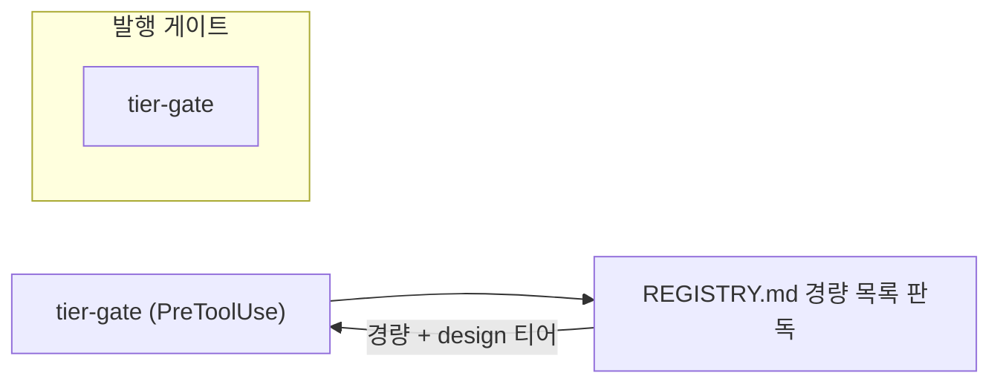

# diagram — when a document owes a diagram, and how to draw one that survives

## Why this skill

Prose is bad at two things: **order** and **branching**. A reader following "the driver launches a session, which writes a carryover note, which the next iteration reads unless the exit watch fired" has to hold a state machine in their head, and rebuilds it from scratch on every re-read. A diagram makes that structure hold still.

But "use diagrams when they help" is a rule nobody applies — it has no firing condition, so it loses to whatever is faster today. This skill replaces the judgment call with a **test on the document's content**, and pairs it with the failure modes that make a Mermaid diagram silently wrong.

## 1. Does this document owe a diagram?

Read what the document already says. **Each condition carries a threshold, and the threshold is the whole rule** — the bare shapes (an actor, a state, a branch, a component) are in every technical document ever written, so a condition without one fires on all of them and mandates noise. Measured 2026-08-03: the unthresholded first draft of this table fired on **16 of 16** governed sections in this repository, including one whose entire content was `exit 0(통과) / exit 65(차단)`.

| The section describes | Draw | **Only when** | Prose loses |
|---|---|---|---|
| an exchange between **2+ named actors** | `sequenceDiagram` | **3+ messages**, and at least one is not a direct reply to the one before it — a branch, a loop, or a third party entering | who acts, in what order, what crosses each boundary |
| one thing moving between **named states** | `stateDiagram-v2` | **3+ states** and at least one transition that is not "next" — a loop back, a state two others reach, or a terminal reachable early | which transitions exist, and which are dead ends |
| **decision points** | `flowchart` | **2+ decisions**, or one whose branches each continue for 2+ further steps. This bar alone does not discriminate — three `pass/block` exits satisfy it literally — so **the deciding test below settles ⓒ**, and it is not optional there | that the branches are exhaustive, and where each lands |
| components in a **containment or dependency structure** | `flowchart` (`erDiagram` for data) | **4+ components and 3+ relations among them, and those relations are not a single linear chain** — N components in a chain always have N−1 relations, so the count alone can never exclude one, and a chain is a sentence (`A → B → C → D`) | what contains what, and what may not reach what |

**The deciding test, when a threshold is borderline** — this is operative, not a gloss: *to answer the question this section exists to answer, must the reader hold two or more relationships in mind at once?* **If one sentence restates the structure without loss, do not draw it.** A single pass/block exit is a sentence. Four files sharing nothing but a parent directory are a list.

**No condition met → do not draw one.** A diagram restating what the text already says costs review attention and earns nothing.

**Where this fires** — three document *types*, not three heading names:
- **Spec** (`doc-writer` template 1) — in the section describing the changed boundary or design. That is `## 인터페이스 / 설계 개요` in the template, but **root harness specs use their own numbered structure**, so key on the section that plays that role, not on its title. 6 of 22 specs in this installation have no section by that name at all.
- **PR body** (`doc-writer` template 5) — `## 변경 내용`.
- **work-tracker issue** — the registration template's `## 흐름` section, which exists for this.

Other documents (README, runbook, ADR, work report) may carry a diagram when it helps — the table is good advice there — but nothing requires it. Reason: those three are where a reader arrives without context and pays the reconstruction cost repeatedly; a README reader is deciding whether to use the thing, and a runbook reader follows steps already ordered by their numbering.

**A diagram already drawn in another form satisfies this.** `docs/specs/2026-07-19-autoloop-driver.md` carried a hand-drawn ASCII diagram of its driver loop long before this rule existed — the need was real enough that someone drew it by hand. Converting such a diagram to Mermaid buys checkability and consistent rendering, not new information, so it is **worth doing when the file is next edited and never on its own**.

## 2. Which tool

**Mermaid, inline, is the default and usually the end of it.** The source stays in the document, a diff shows what changed, and GitHub recognizes a ```mermaid fence as its own language (measured 2026-08-03: `POST /markdown` returns `highlight-source-mermaid`; that the web UI draws it is **not** verified from here).

Escalate only when the check says the diagram outgrew Mermaid — past about 15 nodes:

| Where it renders | Past the threshold |
|---|---|
| **Repository Markdown** (spec, README, docs/) | render to SVG with `d2`, commit it beside the document, embed with `` |
| **Issue or PR body** | **split the diagram**, do not escalate — a body cannot reference a repository-relative image, so an SVG there is a broken link |

`d2` is optional. When it is missing, say so and keep the diagram in Mermaid rather than installing a toolchain mid-task — a dense diagram the reader can see beats a perfect one that does not exist. Write the `.d2` source beside the SVG with the same base name; a rendered file with no source can only be redrawn, never corrected.

## 3. Quote every label in a flowchart

`Error parsing Mermaid diagram!` replaces the whole diagram with an error block, and the document still looks finished in the source. The cause is almost always a label Mermaid could not read — unquoted it accepts far less than the prose suggests.

So in `flowchart` and `graph`, write every label with quotes:



Unquoted, a parenthesis or a double quote ends the statement — in a node label, an edge label, or a `subgraph` title, which has no brackets to make the rule visible. A parenthesis is balanced, so no delimiter count catches it. Quoting always is one habit instead of a list of exceptions.

Two further mistakes cost a whole diagram:

- **A `subgraph` title is not a node id.** Give the subgraph an id and reference that — `subgraph HW["1. Hardware Layer"]` then `HW --> ORCH`. An id holds no space, so `1. Hardware Layer --> 2. Orchestration Layer` cannot parse even though it reads correctly.
- **Every `subgraph` needs its own `end` on a line of its own.** A mistyped `end` reads as an ordinary line and the parser fails far from the actual typo.

A `sequenceDiagram` does not share these rules: it takes a parenthesis unquoted in a participant or a message. The check applies them only where Mermaid does.

## 4. A flowchart label is markdown, so write it as prose

Quoting makes a label **parse**. It does nothing to how the label is **rendered**, because Mermaid hands the text to a markdown lexer either way and supports only paragraph, text, `**bold**`, `*italic*`, and inline HTML. Anything else the lexer produces is thrown away. The diagram parses, so nothing in §3 can see it.

The trap is numbering, because a diagram of layers or phases invites it:

- `1. ` and `1) ` and `01. ` are all ordered-list markers, so renumbering the punctuation does not help. Write `①` or `1 · `. **The backslash escape `1\. ` is not a fix** — it survives the HTML renderer and is dropped by the SVG one, so it works until it does not.
- `- `, `* `, `+ ` at the front of a label are bullets; `# ` is a heading; `> ` is a blockquote; a label that is only `---` is a horizontal rule.
- A backtick pair is inline code and a `[text](url)` is a link. Both vanish, and neither stops at a `<br/>`: the whole label goes to one lexer, so a backtick opened before the break closes after it and takes the label with it. `**bold**` and `*italic*` cross a break safely.
- Break a line with `<br/>`, never `\n` — a markdown label renders `\n` as the two characters. **The break starts a new markdown block, so the front-of-line rules above are read again after it** — but it starts no new inline scope, which is why a backtick opened on one side still closes on the other. The rule applies to node labels, edge labels, and `subgraph` titles alike. A `sequenceDiagram` message is drawn by a different code path that still treats `\n` as a line break.

> These label behaviours were measured against Obsidian's bundled Mermaid in the `nohdol-study` harness, which is where this skill was ported from. **GitHub's Mermaid version is not measured here** — but every habit above costs nothing on a renderer that would have accepted the loose form, so follow them regardless.

## 5. `[[text]]` is a shape, not a link

`id[[text]]` is Mermaid's **subroutine shape** — a double-bordered box. Written unquoted it is easy to reach for by accident (it is character-for-character a wiki-style link, which renders as nothing inside a code fence). The check reports an unquoted subroutine label so the two get told apart deliberately:

- `OBS["세션 로그 수집기"]` — an ordinary box, almost always what was meant.
- `OBS[["세션 로그 수집기"]]` — the subroutine shape, kept on purpose.

## 6. Pre-check before calling it done

```sh
python3 .agents/skills/diagram/scripts/check.py PATH [PATH ...]
```

It reports an unknown Mermaid diagram type, unbalanced delimiters, the label mistakes in §3–§5, a missing embedded asset (`` and `![[]]` forms alike), and it counts nodes to say when a diagram outgrew Mermaid. **The node count is advice** — the document still renders — but it is the signal to escalate or split rather than adding one more edge to something already dense. **Pass an `.svg` as its own argument to check it** for the empty canvas a failed render leaves behind; an SVG merely embedded in a checked document is not opened.

**What it does not see** — these go **unchecked rather than misreported**, because a false "not found" on a gate teaches people to skip the checker: a reference-style `![a][ref]`; a path containing a parenthesis, a space, or a query string; a title in single or round brackets; a suffix outside `.svg/.png/.jpg/.jpeg/.webp` (a `.gif` is never checked); and any target whose existence is undecidable from disk (a URL, a leading `/` with no repository root above the file).

**One known false positive**: an embed inside an **indented** code block is reported, because the fence/span blanking does not model Markdown's four-space code rule — getting that right means modelling list continuation too, and a wrong model in a gate is worse than a named limit. **Write such examples in a fenced block**, which is blanked correctly. An embed inside an HTML comment used to have the same problem and no longer does — but **a whole ```mermaid block inside an HTML comment is still label-checked**, because the fence scan reads raw lines and never consults the blanking pass. The two paths disagree; the embed side was the one that produced false "not found" findings, so it was the one fixed.

The diagram-type list is an **allowlist**, so a type a newer Mermaid adds reports as a problem: widen the list rather than working around it.

**It is a pre-check, not a renderer.** Mermaid's parser is JavaScript and this repository keeps its scripts dependency-free, so a file that passes may still fail to render. `doc-writer`'s self-check step runs it on any document that carries a diagram; look at the rendered result before treating a diagram as delivered.

## Boundaries

- **A diagram is an explanation, not evidence.** A relationship drawn in a diagram is not established by having been drawn — root AGENTS.md §13-2 still decides what a document may claim.
- **Do not send document content to an external rendering or image service** (§3 — that is a publication). A local renderer or nothing.
- **A generated image is not a source.** When a picture comes from an image model rather than a renderer, record that provenance where the document can be read with it and say the image is illustrative.
- **Redraw from the source, never by editing an SVG by hand.**
- **Study-vault notes are not this skill's target** — the `nohdol-study` harness has its own `diagram` skill whose render target is Obsidian and whose escalation path includes JSON Canvas. This is a port of it (2026-08-03); the two are expected to diverge where their render targets do.

## with / without

| Metric | Without this skill | With this skill |
|---|---|---|
| When to draw | "when it helps" — so, in practice, when there is time | A test on the document's content, checked at three named templates |
| Tool choice | Habit, or whatever is installed | Mermaid by default; escalate or split on a counted threshold, by render target |
| Silent failure | Parse error replaces the diagram, or a label renders as `Unsupported markdown` | Caught by the pre-check before the document ships |
| Authority | Diagram read as a finding | Explanation only; evidence rules unchanged |
