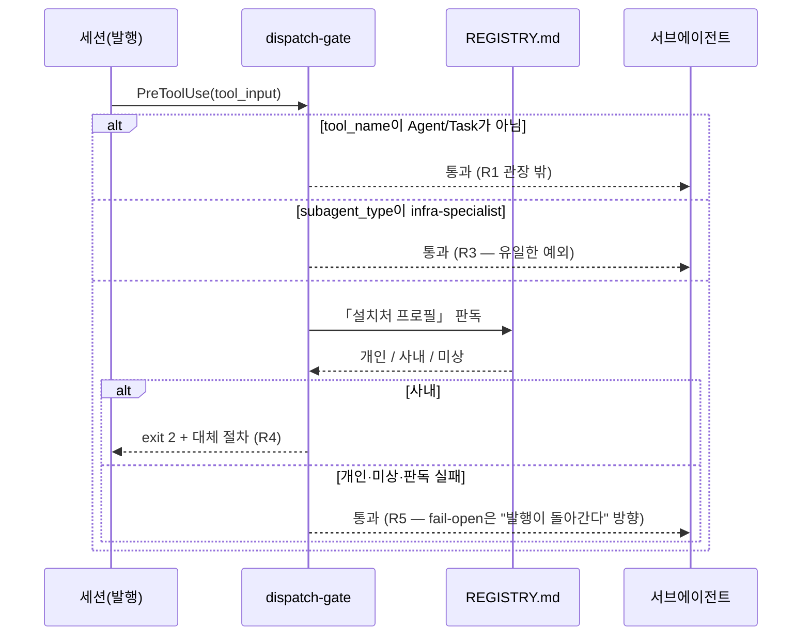

# dispatch-gate 훅 — 사내 프로필에서 서브에이전트 발행 차단

> 상태: 구현됨 · 작성 2026-08-04 · 결정: ADR 042 (ADR 038 확장) · 전신: `review-gate`(스펙 2026-08-03, 이 문서가 대체)

## 1. 배경

서브에이전트 발행 1회의 실측 비용은 검증 기준 **약 100k 토큰과 수 분**이다(metaskill 개선 모드 「검증 비례성」 항이 인용하는 2026-07-17 세션 reviewer 6회 평균). 개인 설치처에서는 품질 대비 타당하지만, **사내 설치처에서는 감당되지 않는다**.

**초판(ADR 038)은 그 비용을 검증 축에만 물었다.** 2026-08-03 사용자 판정이 "사내에서는 reviewer 비용이 감당이 안 된다"였기 때문이며, 그래서 `review-gate`는 `reviewer` 타입 하나만 막고 빌드 측 발행(implementer·explorer·architect·integrator)은 명시적으로 비목표에 두었다. **2026-08-04에 사용자가 축을 넓혔다** — "orchestrate, agents 호출도 사내에서는 안되게 막아줘, 비용이 너무 많이 들어". 남은 발행이 검증만큼 비싸다는 판정이므로, 판정 축이 **"어느 역할인가"에서 "발행인가"로** 바뀐다.

축이 바뀌면 초판이 감수했던 두 구멍이 함께 닫힌다. 초판은 로스터 밖 타입(`general-purpose` 등)과 `subagent_type` 미지정을 통과시켰는데, 둘 다 "리뷰 의도인지 타입으로 알 수 없다"가 이유였다. 새 축에는 그 질문이 없다 — 어느 쪽이든 발행이고 비용은 같다.

## 2. 목표 / 비목표

**목표**

- 설치처 프로필이 `사내`일 때 **서브에이전트 발행을 역할과 무관하게 발행 시점에 차단**한다.
- `infra-specialist` **한 역할만** 통과시킨다 — 비용이 아니라 블라스트 반경으로 판정하는 축이다(7절 5항).
- 차단 메시지가 **대체 절차**(메인 루프 순차 수행 + 팬아웃 없음 기록)를 알린다.
- 개인 설치처의 동작은 **한 바이트도 바뀌지 않는다**.

**비목표**

- 우회 표식을 두지 않는다. 초판의 `[review-ok]`는 폐기한다(사용자 결정 2026-08-04: "사내에선 예외 없음").
- 발행의 **내용**을 판정하지 않는다. 훅은 발행 여부만 본다.
- 세션 외부 프로세스는 대상이 아니다 — `autoloop`은 `claude -p`·`codex exec`로 별도 세션을 띄우므로 PreToolUse에 걸리지 않는다. 그 세션들이 각자 이 규칙 아래 놓일 뿐이다.
- 테스트·스펙 게이트·§3 가드레일은 손대지 않는다. 이 변경이 없애는 것은 **팬아웃**이지 증거가 아니다.

## 3. 요구사항

| ID | 요구사항 |
|---|---|
| R1 | `tool_name`이 `Agent`/`Task`이면 **`subagent_type`이 무엇이든**(미지정·비문자열 포함) 판정 대상이다 |
| R2 | REGISTRY.md 「설치처 프로필」이 `사내`일 때만 차단한다. 그 외(`개인`·미상·부재·판독 실패)는 통과 |
| R3 | `subagent_type`이 `infra-specialist`(대소문자·여백 무시)이면 통과한다 — **유일한 예외** |
| R4 | 차단 시 stderr로 대체 절차를 알리고 exit 2 |
| R5 | 어떤 예외·형식 불명 입력도 통과(fail-open). **fail-open 방향은 "발행이 돌아간다"** — tier-gate와 반대로, 판독 실패가 개인 설치처를 건드리지 않는 쪽으로 떨어진다 |
| R6 | 프로필 판독은 `_common.read_profile` 단일 원본을 쓴다. 파서를 복제하지 않는다 |
| R7 | 등록 shim은 훅 파일 부재 시 통과한다(`[ -r "$f" ] \|\| exit 0`) |
| R8 | **우회 표식이 존재하지 않는다** — 어떤 문자열도 차단을 무르지 않는다 |

## 3-1. 판정 경로

## 4. 판정 범위 (명시)

**이번에는 훅이 규칙과 거의 같은 넓이다.** 남는 간극은 하나이고 아래에 적는다 — `infra-specialist`의 리뷰 모드다. 초판은 "검증 목적"이라는 **의도**를 규칙이 끄고 훅은 `subagent_type`이라는 **타입**만 볼 수 있어 둘의 넓이가 달랐고, 그 간극을 4절이 두 축(과잉·과소)으로 나눠 설명해야 했다. 새 축은 타입을 읽을 필요가 없다 — 발행이면 막는다. 그래서 남는 간극이 아래 한 축뿐이고, 그 하나를 빼면 세션의 기억에 남는 판정이 없다.

**`infra-specialist`만 예외인 이유는 비용이 아니다.** 7절 5항이 k8s·IaC 변경을 이 역할로 보내는 근거는 admission 선확인이고, 그것 없이 만든 매니페스트 값은 리소스 생성 시점에 터진다. 즉 이 축은 **끊었을 때 더 비싼 유일한 축**이다. 사용자에게 명시적으로 물어 확정했다(2026-08-04, 3문항 인터뷰 중 3번). **훅은 타입을 면제하지 이 역할의 모든 용도를 면제하지 않는다** — 저작 모드와 리뷰 모드를 `subagent_type`으로 구분할 수 없으므로, 리뷰 모드 배치가 사내에서 꺼져 있다는 것은 규칙이 관장한다(`.agents/agents/infra-specialist.md`). ADR 038이 남긴 구조 중 유일하게 규칙-관장으로 남는 축이며, 위 「거의 같은 넓이」가 가리키는 간극이 이것이다(독립 검증 지적). **현재 이 설치처의 사내 등록 프로젝트(agent-eval-gate)에는 k8s가 없으므로, 이 예외는 아직 한 번도 발화한 적이 없다** — 미래 대비 조항이며 그 사실을 숨기지 않는다.

**우회 표식을 없앤 근거.** 초판은 `[review-ok]`를 두었고 그 값은 "기계적 보증이 아니라 기록이 남는 우회"였다. 축이 넓어지면서 그 구조가 뒤집힌다 — 가장 비싼 `reviewer`에만 탈출구가 있고 더 싼 역할에는 없는 상태가 되기 때문이다. 사용자가 "사내에선 예외 없음"으로 정했고, 그래서 표식은 폐기했다. **발행이 정말 필요하면 훅 등록을 걷는 것이 유일한 경로이고, 그것은 설정 파일 diff로 남는다** — 프롬프트 문자열보다 강한 기록이다.

**팬아웃 스킬은 정지가 아니라 저하다**(사용자 결정 2026-08-04). `project-status`·`team-review`·`harness-review`는 계속 발동하되 메인 루프가 순차로 수행하고, 산출물에 팬아웃 없이 돌았다고 적는다. 스킬을 비발동으로 두는 안은 상태 요약·리뷰를 아예 못 받게 되므로 기각했다.

## 5. 완료 기준

- [x] C1 (R1·R2·R4): 프로필 `사내` + `reviewer` 발행 → **리터럴 exit 2**(PreToolUse가 키로 삼는 값이므로 상수가 아니라 리터럴로 고정한다), stderr에 대체 절차·ADR 번호
- [x] C2 (R1): `tool_name`이 `Task`인 갈래도 같이 판정된다
- [x] C3 (R2): 프로필 `개인` + **차단 대상 역할 9종 전부** → exit 0, stderr 없음
- [x] C4 (R2): REGISTRY.md 부재 → exit 0 (미상은 차단하지 않는다)
- [x] C5 (R1): 프로필 `사내` + `reviewer`·`implementer`·`explorer`·`troubleshooter`·`architect`·`integrator`·`general-purpose`·`Explore`·`claude` → **전부 exit 2** (초판 C5의 반전)
- [x] C6 (R3): 프로필 `사내` + `infra-specialist`(여백·대소문자 변형 포함) → exit 0
- [x] C7 (R1): `tool_name`이 Agent/Task가 아니면 exit 0
- [x] C8 (R5): 형식 불명 stdin(빈 문자열·비JSON·배열·`tool_input: null`·`tool_input`이 배열) → exit 0, 무출력
- [x] C9 (R5): 판독 함수가 예외를 던져도 exit 0
- [x] C9b (R1): `subagent_type` 미지정·비문자열·빈 `tool_input`도 **exit 2** (초판 C9 후단의 반전). 메시지는 빈 타입명을 노출하지 않는다
- [x] C10 (R6): 훅이 쓰는 판독기가 `_common.read_profile` **그 객체**다(복제로 되돌아가는 회귀를 막는 위치 고정)
- [x] C11 (R8): `OVERRIDE` 상수가 존재하지 않고, 표식 5종(`[review-ok]`·`[agent-ok]`·`[dispatch-ok]`·`[light-ok]`·`[no-test]`)이 프롬프트에 있어도 exit 2 — **상수 부재만 보면 이름을 바꿔 되살리는 변이가 통과**하므로 동작으로도 확인한다
- [x] C13 (R3): 면제 판정은 **동등 비교**다 — `infra-specialist-lite`·`my-infra-specialist`·`infra-specialists`가 사내에서 exit 2. R8이 표식을 없앤 뒤로 `infra-specialist`는 통과를 사는 **유일한 문자열**이라, 부분 문자열·접두 비교로 바꾸는 변이가 그 이름을 접두로 가진 무엇이든 통과시킨다(독립 검증 C-01 실측)
- [x] C14 (R5·R6): `_common` 유실 시의 폴백 `read_profile`이 **항상 미상**을 돌려준다 — `CORPORATE`를 돌려주면 개인 설치처에서 발행이 막혀 목표 4를 정면으로 어긴다. `_common_test.py`의 C4가 `utf8_stdio`만 보고 있어 이 갈래의 커버리지가 0이었다(독립 검증 C-02)
- [x] C15 (R2): 프로필 절 제목을 **접두+낱말경계**로 읽는다 — `## 설치처 프로필 (ADR 012)`처럼 괄호 설명을 달아도 읽히고, `## 설치처 프로필별 메모`는 다른 절로 남는다. 정확 일치이던 동안 괄호 하나로 절이 조용히 미상이 됐고 **그 미상은 ADR 042 이후 차단 전체의 해제**다(독립 검증 C-04 실측). `_common.py`의 경량 절이 이미 쓰던 판정과 같은 형태로 맞췄다
- [x] C16 (등록 가시성): `.claude/settings.json`에서 이 훅의 등록이 사라지면 무결성 **R21**이 FAIL한다. R18은 Codex 쪽만 봐서, Claude 등록을 지워도 무결성 출력이 바이트 단위로 동일했다(독립 검증 C-03 실측)
- [x] C12 (R6): `harness-review-reminder` 스위트 37건이 개명 후에도 전부 통과 — 프로필 절 한정·코드 펜스·제목 레벨의 의미 축은 **그 스위트가 같은 함수에 대고** 판정하므로 여기서 다시 세우지 않는다(§16)

> C1~C11·C13은 `python3 .agents/hooks/dispatch-gate_test.py`(12건), C14~C15는 `python3 .agents/hooks/_common_test.py`(10건), C16은 `python3 .agents/hooks/integrity-check_test.py`(63건), C12는 `python3 .agents/hooks/harness-review-reminder_test.py`(37건)로 판정한다. 스위트가 실제로 무언가를 고정하는지는 **변이 9종**을 임시 사본에 넣어 확인했고 전부 실패로 잡힌다: `EXEMPT_AGENTS`에 `reviewer` 추가(4건 실패), `EXEMPT_AGENTS` 비움(1건), 미지정 통과로 되돌림(1건), `AGENT_TOOLS`에서 `Task` 제거(1건), `BLOCK_EXIT`→0(5건), `[review-ok]` 우회 부활(1건), **면제를 부분 문자열 비교로(1건), 프로필 제목을 정확 일치로 되돌림(1건), 폴백 판독기가 `사내` 반환(1건)** — 뒤의 셋은 독립 검증이 살아남는 변이로 지목한 것들이다.

## 6. 미해결

- **이 설치처가 `개인`이라 차단 경로를 실환경에서 관측하지 못했다.** 판정은 임시 REGISTRY.md를 깐 테스트로만 확인했다 — 초판과 같은 한계이고, 사내 기계의 첫 세션이 실제 관측 지점이다.
- **Codex 런타임의 발행 도구명은 미실측이다.** `.codex/config.toml`에 같은 매처로 등록하지만, `spawn_agent`가 어떤 `tool_name`으로 오는지 여기서 잰 적이 없다. 어긋나면 발화하지 않을 뿐이다(fail-open).
- **R7(등록 shim의 `[ -r "$f" ]` 가드)에는 아직 고정 케이스가 없다.** 두 설정에서 가드를 걷어도 스위트가 초록이다(독립 검증 Low). 실패 방향이 안전한 쪽(훅 파일이 없으면 셸이 오류를 내고 발행은 그대로 진행)이라 이번에는 남긴다.
- **`Workflow` 도구는 대상이 아니다.** 매처가 `Agent`이므로 워크플로 경유 발행은 걸리지 않는다. 이 하네스가 워크플로를 쓰지 않아 실제 경로는 없지만, 구멍인 것은 사실이라 적어 둔다.
