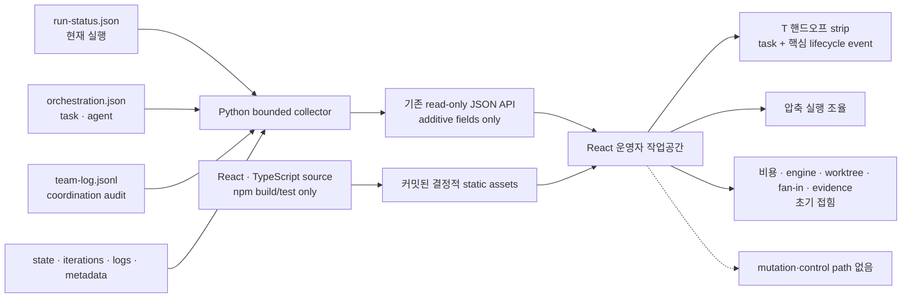

# 스펙: autoloop 대시보드 운영자 UX 개편

- 날짜: 2026-08-19 / 상태: 확정
- 관련: `docs/specs/2026-08-19-autoloop-dashboard.md`, `docs/specs/2026-08-19-autoloop-orchestration-runtime.md`, ADR 047·048·049

## 배경

현재 autoloop 대시보드는 새 구조화 실행의 task DAG·agent·dispatch·integration·worktree·evidence를 읽기 전용으로 투영한다. 그러나 정보가 표와 원시 기록에 가깝게 나열되어 운영자가 현재 실행, 차단 원인, 병렬·대기 관계, writer worktree와 fan-in 결과를 빠르게 훑기 어렵다. `team-log.jsonl`도 화면에 없어 선행 task 완료와 후속 dispatch 같은 기록된 흐름을 시간순으로 확인할 수 없다.

과거 실행은 `run-status.json`·`orchestration.json`이 없어 구조화 필드가 없다. 이를 오류처럼 보이게 하거나 현재 스키마로 추정 복원하면 실제 기록과 추론이 섞인다. 따라서 기존 관측·안전 계약을 유지하면서 현재 상태와 주의 지점을 우선하는 운영자 중심 정보 구조로 개편한다.

## 목표

- 첫 화면에서 실행 중·차단·실패·갱신 지연 작업과 다음 확인 지점을 빠르게 찾는다.
- task 간 기록된 시작·완료·실패 순서를 T 핸드오프 흐름으로 빠르게 추적한다.
- `team-log.jsonl`을 간결한 coordination 요약으로 보여 주되 기록에 없는 대화나 내부 추론을 만들지 않는다.
- legacy 작업은 구조화 기록이 없다는 이유와 현재 확인 가능한 aggregate 정보를 구분한다.
- 키보드·스크린리더·좁은 화면에서도 핵심 상태와 상세 정보에 접근한다.
- agent별 역할·엔진·실행 시각과 worktree·비용·로그는 필요할 때만 펼쳐서 확인한다.
- Light를 첫 방문 기본값으로 하고 System·Dark 테마를 선택할 수 있게 한다.
- loopback·읽기 전용·bounded read 안전 계약과 API 호환성을 보존한다.
- React·TypeScript 의존성은 빌드에만 사용하고, 커밋된 정적 산출물의 실행에는 Python만 요구한다.

## 비목표

- agent 간 자유 대화, direct message, ask/reply 프로토콜을 만들지 않는다.
- task DAG나 그래프 탐색 UI를 제공하지 않는다.
- scheduler, task DAG 생성, writer worktree 생성·fan-in·cleanup 정책을 바꾸지 않는다.
- 시작·재시도·중단·승인·삭제 같은 제어 기능을 제공하지 않는다.
- 과거 작업의 누락된 DAG·agent·메시지를 추정하거나 소급 생성하지 않는다.
- CDN·원격 asset·일반 차트 프레임워크·데이터베이스를 도입하지 않는다.
- 기록에 없는 완료율·agent 대화·지속 시간·비용 상한을 추정하지 않는다.
- loopback 밖 원격 접속, 인증, 멀티테넌시를 추가하지 않는다.

## 요구사항

- **R1 (운영 질문 중심 작업공간)**: master-detail 구조를 유지하고 첫 화면에서 “무엇이 실행 중인가, 정상인가, 내가 할 일이 있는가”를 답한 뒤 기술 세부 정보를 공개한다.
- **R2 (주의 우선 목록)**: 차단·실패·중단, stale-running, 정상 running, done 순으로 정렬하고 각 묶음은 최신순으로 둔다. 검색, 상태·tracking·provenance 필터, 대체 정렬, 요약과 결과 수를 제공하며 tracking·provenance는 운영 상태보다 앞서지 않는다.
- **R3 (상태와 신선도)**: 모든 상태를 색상 외 아이콘·텍스트·형태로 구분하고 상대·절대 갱신 시각을 함께 표시한다. stale 경계 이상인 running은 기록 상태를 실패로 바꾸지 않고 “갱신 지연”으로 표시한다.
- **R4 (안정적인 폴링 상호작용)**: 폴링 뒤에도 선택, 열린 상세, scroll과 focus를 가능한 범위에서 유지한다. 자동 갱신 일시정지·재개, 수동 갱신, 마지막 성공, 실패·회복·선택 소멸을 loop 실패와 구분해 알린다.
- **R5 (최소 개요)**: 선택 작업의 phase·주의 이유·최신 test·남은 항목·freshness만 첫 상세 화면에 둔다. task 수·활성 agent·비용·엔진·commit은 기본 화면에서 제외하고 기록에 없는 완료율도 표시하지 않는다.
- **R6 (T 핸드오프 흐름)**: 허용된 `team-log.jsonl` event를 시간순으로 정렬해 `팀 생성 → T1 시작 → T1 완료 → 통합 완료`처럼 한눈에 읽히는 연속 strip으로 표시한다. task event 외 lifecycle event는 `team_create`와 `integration_complete`만 포함하며 각각 `팀 생성`, `N차 통합 완료`처럼 짧게 표시한다. 같은 task·wave·event가 감사 기록에 반복되면 원본은 보존하되 strip에서는 한 번만 표시한다. timestamp가 같으면 `팀 생성 → 작업 시작 → 작업 완료/실패 → 통합 완료` 순으로 표시해 lifecycle 인과를 읽을 수 있게 한다. task ID·wave·event·상태는 기록값만 사용하고 dependency·대화·결과 전달을 추정하지 않는다. event가 없으면 빈 상태를 표시하며 DAG fallback을 만들지 않는다.
- **R7 (폐기 — 실행 시간축 없음)**: 2026-08-20 폐기. agent 실행 구간을 별도 시간축이나 순서축으로 그리지 않는다. 상세 기본 화면에는 실행 축 요소와 `시간축` 문구를 두지 않고, agent ID·상태·실행 시각은 R9의 `실행 세부 정보 > 에이전트` 한 곳에서만 제공한다. 그 결과 화면은 위치·길이 계산을 위한 inline style을 만들지 않는다.
- **R8 (압축 실행 조율)**: 기본 화면은 실행 묶음 수·선행 작업 대기 수·실행 조정 수만 한국어로 보여 준다. event 수와 최신 event는 T 핸드오프와 같은 사실을 다시 요약하므로 표시하지 않는다. 접힌 상세를 열면 실행 묶음과 대기만 각각 제목·상태·시간이 있는 짧은 카드로 제공한다. `최근 협업 기록`처럼 T 핸드오프와 같은 event를 다시 나열하는 영역은 두지 않는다. chat·추론·direct message·기록되지 않은 결과 전달로 표현하지 않는다.
- **R9 (사람이 읽는 실행 세부)**: integration·worktree·engine/fallback·model tier/실제 전달 모델/source·agent 시작·종료 시각·path·base/task/integration commit·fast-forward·cleanup·실패 단계는 하나의 초기 접힘 “실행 세부 정보” 안에서 정확히 표시한다. 에이전트 카드는 `역할 · tier · 모델 · 엔진 · 실행 시간` 순으로 사람이 읽게 하며, 모델 미지정은 실제 CLI 기본 이름을 추정하지 않고 `CLI 기본값 · 미보고`로 표시한다. 펼친 내용은 내부 필드명과 구분점 나열 대신 `에이전트`·`통합 결과`·`작업 공간`·`실행 기록`·`확인할 문제`의 의미 단위, 한국어 라벨, 상태 요약, 빈 상태로 구성한다. 원문이 필요한 경로·commit·log만 고정폭으로 보존한다. worktree 경로는 복사만 허용하고 integration은 worktree row 유무와 독립적으로 표시한다.
- **R10 (접힌 비용 정보)**: 비용은 초기 접힘 “실행 세부 정보” 안에 누적 숫자와 `full`·`partial`·`unavailable`·`unknown` 의미만 표시한다. 반복별 비용 그래프는 제거하고 미측정 값을 `$0.00`으로 표시하지 않는다.
- **R11 (bounded artifact 수집)**: `team-log.jsonl`과 `dashboard-meta.json`에 작업 경계·심볼릭 링크 방어를 적용한다. 제한 바이트·event 수만 읽고 손상은 해당 작업 diagnostics로 격리하며 allowlist 밖 필드는 view model로 승격하지 않는다.
- **R12 (tracking·legacy·demo 진실성)**: 기존 `source` 의미를 보존하고 `tracking`은 `orchestration.json`, `provenance=demo`는 정확한 bounded metadata schema만 정본으로 삼는다. unstructured 실행은 aggregate 정보를 유지하고 누락된 agent·edge를 복원하지 않는다.
- **R13 (점진적 공개·반응형)**: 기본 상세에는 최소 개요·T 핸드오프·압축 실행 조율만 이 순서로 둔다. 비용·engine·worktree·integration·commit·diagnostics·evidence·log는 초기 접힘으로 두고, 넓은 화면은 목록+상세, 좁은 화면은 목록→상세를 제공한다.
- **R14 (테마와 시각 체계)**: semantic token으로 Light·System·Dark를 제공한다. 첫 방문은 Light이며 유효한 local preference만 저장하고 System은 OS 변경을 따른다. 서버에 preference를 쓰지 않는다.
- **R15 (접근성)**: 모든 control·handoff·disclosure·filter·selection·copy·theme 선택에 accessible name, visible focus와 keyboard operation을 제공한다. landmark·heading·live region·reduced motion·200% 확대·WCAG AA 명암과 시각 strip의 동등한 텍스트를 완료 조건으로 둔다.
- **R16 (React·TypeScript 빌드 경계)**: strict TypeScript·React·Vite로 frontend를 작성하고 결정적 production build를 커밋한다. Node/npm은 개발·빌드·테스트에만 사용하며 정상 dashboard 실행은 `python3 dashboard.py`만 요구하고 Node process·CDN·remote asset을 사용하지 않는다.
- **R17 (로컬 읽기 전용 보안·호환)**: `127.0.0.1`, loopback Host, method/path/symlink 방어, bounded read, CSP·`nosniff`·`no-store`·referrer policy와 기존 JSON 의미를 보존한다. Python은 고정된 build asset route만 제공한다. 외부 문자열은 escaped React text child로만 렌더링하고 unsafe HTML·parsing·실행·style·URL sink를 금지한다.
- **R18 (최소 의존성)**: runtime frontend 의존성은 React·React DOM으로 제한한다. handoff·status는 platform·CSS·SVG로 만들고 graph·router·상태관리·chart·icon·CSS-in-JS·schema framework를 추가하지 않는다.
- **R19 (검증 표면)**: Python collector·security 회귀를 유지하고 inline string 검사는 TypeScript unit/component test로 대체한다. structured·unstructured·corrupt fixture와 실제 browser smoke를 추가하며 독립 review는 이 스펙과 ADR 047·048·049를 함께 판정한다.

## 인터페이스 / 설계 개요

artifact 역할은 바꾸지 않는다. Python은 bounded artifact 수집·JSON API·고정 static asset 제공을 맡고, React는 표시와 browser-local 상호작용만 맡는다. build 결과는 저장소에 커밋되어 실행 시 Node가 필요하지 않다.

- frontend source와 lockfile은 `.agents/skills/autoloop/dashboard-ui/`에 두고 `dist/index.html`, `dist/assets/app.js`, `dist/assets/app.css`를 결정적 이름으로 생성한다.
- `dashboard.py`는 자신의 real path를 기준으로 dist root를 찾고 `/`, `/assets/app.js`, `/assets/app.css`만 정확한 MIME으로 제공한다. 일반 directory server나 SPA catch-all은 두지 않는다.
- CSP는 외부 script·connection을 차단하고 inline style도 허용하지 않는다(`style-src 'self'`). artifact text는 style·URL에 전달하지 않는다.
- 목록 view model의 `attention_rank`·freshness·`source`·`tracking`·`provenance`는 scheduler 판정에 쓰지 않는다. stale는 관측 경고이며 loop gate가 아니다.

## 완료 기준 (테스트 가능한 형태)

- [x] **C1 (R1·R2)**: structured·unstructured blocked, stale-running, running, done, interrupted fixture를 읽으면 운영 상태가 tracking·provenance보다 먼저 정렬되고 summary·filter·대체 sort·결과 수가 fixture와 일치한다.
- [x] **C2 (R3)**: 지원 상태와 stale 경계 직전·경계·직후를 렌더링하면 각 상태에 비색상 cue와 상대·절대 시각이 있고 stale-running의 기록 상태는 running으로 남는다.
- [x] **C3 (R4)**: poll update·failure·recovery·pause·resume·selection removal을 실행하면 가능한 selection·disclosure·scroll·focus가 유지되고 pause 중 요청이 없으며 refresh 상태를 loop 상태로 오인하는 알림이 없다.
- [x] **C4 (R5)**: 혼합 상태 task를 선택하면 첫 detail viewport에는 phase·attention·test·remaining·freshness만 보이고 task 수·active agent·cost·engine·commit·percent-complete는 없다.
- [x] **C5 (R6)**: out-of-order task event fixture를 렌더링하면 timestamp 순서의 `T ID + event` chip과 chip 사이 방향 cue가 하나의 handoff strip에 있고, source 어디에도 React Flow·Dagre import나 `Task DAG` UI가 없다. event 없는 fixture는 빈 상태만 보인다.
- [x] **C6 (R6·R15)**: T 핸드오프 strip은 시각 순서와 같은 accessible ordered text를 제공하며 기록에 없는 dependency·대화·결과 전달 문구가 없다.
- [x] **C7 (R7 폐기)**: agent 실행 기록이 있는 작업을 선택하면 상세 기본 화면의 제목이 `T 핸드오프`·`실행 조율`뿐이고, 실행 축 요소(`.agent-track`)와 `시간축` 문구, 위치 계산용 inline style이 하나도 없다. 같은 agent의 상태·실행 시각은 `실행 세부 정보 > 에이전트` 카드에서 API와 같은 값으로 읽힌다.
- [x] **C8 (R8)**: dispatch·dependency wait·fallback·event fixture를 렌더링하면 기본 실행 조율은 실행 묶음·선행 작업 대기·실행 조정 count만 표시하고 event 수·최신 event를 반복하지 않는다. 하나의 초기 접힘 상세을 열었을 때 wave와 대기만 구분된 제목으로 읽힌다. 비dependency blocker를 wait로 재해석하지 않고 chat·reasoning·direct message·미기록 결과 전달 문구가 없다.
- [x] **C9 (R9)**: 초기 화면에 worktree·integration·engine·commit 목록이 없고 “실행 세부 정보”를 열면 `에이전트`·`통합 결과`·`작업 공간`·`실행 기록`·`확인할 문제`별 카드에서 정확한 path·engine/fallback·commit·fast-forward·cleanup·failure stage를 한국어 라벨과 상태 요약으로 읽는다. 빈 묶음은 빈 상태를 표시하고 내부 영문 복수형 제목이나 구분점 한 줄 나열을 사용하지 않는다. integration은 worktree row 유무와 무관하며 path 동작은 copy뿐이다.
- [x] **C10 (R10)**: 초기 화면에 비용 그래프가 없고 “실행 세부 정보”를 열면 full·partial·unavailable·unknown 누적 비용 텍스트만 정확히 나타난다. unavailable·unknown은 `$0.00`이 아니며 percent·budget line이 없다.
- [x] **C11 (R11)**: event·metadata가 oversized·malformed·unsupported·symlink이면 나머지 task API는 성공하고 byte·event limit, diagnostics·truncation이 남으며 allowlist 밖 필드가 노출되지 않는다.
- [x] **C12 (R12)**: exact·missing·malformed·oversized·symlink·misleading-name fixture를 읽으면 기존 `source`가 유지되고 tracking·provenance는 명시 artifact만 따른다. unstructured 실행은 aggregate를 유지하고 node·agent를 만들지 않는다.
- [x] **C13 (R13)**: 1440px·390px browser smoke에서 최소 개요→T 핸드오프→압축 실행 조율 순서만 기본 노출되고 기술 세부는 접혀 있다. mobile에서 목록으로 돌아가며 document horizontal overflow가 없다.
- [x] **C14 (R14)**: Light·Dark·System을 선택하면 semantic token이 해석되고 첫 방문은 Light이며 유효 mode만 지속된다. System은 OS 변경을 따르고 server preference mutation은 없다.
- [x] **C15 (R15)**: keyboard-only·200% zoom·reduced motion으로 동작하면 모든 path가 사용 가능하고 focus·live update가 정확하며 automated accessibility serious/critical finding이 없고 theme/state text와 focus가 WCAG AA를 충족한다.
- [x] **C16 (R16·R18)**: lockfile 기준으로 typecheck·test·build하면 React·React DOM만 runtime frontend dependency로 남고 `dist/index.html`, `assets/app.js`, `assets/app.css`가 결정적으로 생성된다. Node를 `PATH`에서 제거해도 `python3 dashboard.py`가 같은 build를 CDN·remote request 없이 제공한다.
- [x] **C17 (R17)**: root·API·asset·error route를 요청하면 loopback Host, read-only method, fixed static confinement, symlink/path traversal, MIME, CSP, `nosniff`, `no-store`, referrer header가 통과하고 CSP가 inline style을 허용하지 않는다. 앱 소유 source와 렌더 경로에서 외부 artifact가 unsafe HTML·실행·style·URL sink로 흐르지 않으며, dependency bundle 내부 API 이름의 단순 문자열 부재를 완료 조건으로 삼지 않는다.
- [x] **C18 (R19)**: structured·unstructured·corrupt·attention fixture를 unit/component·real browser로 실행하면 list·최소 overview·T handoff·압축 coordination·접힌 technical detail·polling·theme·responsive·keyboard 동작이 포함된다.
- [x] **C19 (R19)**: 기존 dirty collector 작업을 migration하면 collector·freshness·tracking/provenance·bounded event·DAG validation·worktree/integration·legacy·cost·symlink·JSON·API·driver 회귀가 모두 통과하고 obsolete inline-HTML assertion만 동등 frontend test로 대체된다.
- [x] **C21 (R9)**: structured task의 agent record에 model tier와 모델명이 있으면 API detail과 펼친 `에이전트` 카드가 역할·tier·모델·엔진을 정확히 표시한다. 모델명이 비어 있고 source가 `cli_default_unreported`면 `CLI 기본값 · 미보고`로 표시하며 engine이나 tier를 모델명처럼 대체하지 않는다. legacy artifact는 기존 빈 상태를 유지한다.
- [x] **C22 (R6·R8·R9·R15)**: `team_create`·task dispatch/complete·`integration_complete`가 섞이고 동일 task 완료가 통합 전후에 반복된 fixture를 렌더링하면 T 핸드오프가 `팀 생성`·`T ID 시작/완료`·`N차 통합 완료` chip과 동등한 접근성 텍스트를 한 번씩 표시한다. 동일 timestamp에서는 lifecycle 인과 순서를 지키고, 서로 다른 timestamp는 시간순을 지킨다. `실행 조율` 기본 요약은 실행 묶음·선행 작업 대기·실행 조정만 표시하고 event 수·최신 event를 반복하지 않으며, 펼친 상세에는 실행 묶음과 선행 작업 대기만 있고 `최근 협업 기록`이나 동일 event 목록이 없다. 상세 기본 화면에는 별도 `에이전트 세부 정보`가 없고, 역할·tier·모델·엔진·실행 시간·fallback은 `실행 세부 정보 > 에이전트` 한 곳에서만 확인된다. task ID나 wave가 없는 lifecycle event도 빈 `undefined` 문구 없이 읽힌다.
- [x] **C20 (전체)**: Python dashboard·driver, npm typecheck·unit·build, browser smoke·accessibility, diagram, integrity, `git diff --check`를 실행하면 모두 통과하고 independent reviewer가 개정 스펙과 ADR 047·048·049에 PASS한다.

## 미해결 질문

없음. 사용자가 시각화 우선, React·TypeScript, 밝고 친근한 기본 경험을 확정했다. coordination은 기록된 event timeline이며 채팅 UI로 확장하지 않고, legacy는 추정 복원하지 않는다.

## 변경 이력

| 날짜 | 변경 내용 | 대상 | 사유 |
|---|---|---|---|
| 2026-08-20 | R7을 폐기하고 목표·R13·R15·R18·C7·C13·C17·C18·C22와 설계 개요에서 실행 시간축을 제거. 축이 사라지며 inline style 소비처가 없어져 CSP `style-src`에서 `'unsafe-inline'`도 함께 회수 | 목표, R7·R13·R15·R18, 설계 mermaid·CSP 항목, C7·C13·C17·C18·C22, React 상세 화면·styles.css·`dashboard.py` CSP·frontend·Python tests | 사용자가 상세 화면에서 실행 시간축도 필요 없다고 판단했다. agent ID·상태·실행 시각은 이미 `실행 세부 정보 > 에이전트`에 있어 축 제거로 사라지는 기록값이 없고, 축이 유일한 inline style 소비처였다 |
| 2026-08-20 | R6~R9·R13·C8·C13·C22에서 화면 간·화면 내 정보 중복 제거와 lifecycle handoff 통합 | T 핸드오프·실행 시간축·실행 조율·실행 세부 정보·frontend tests | `최근 협업 기록`과 이중 agent disclosure를 제거하고, 핵심 lifecycle을 handoff에 합치며 실제 운영 기록에서 반복된 task 완료도 strip에서 한 번으로 압축하라는 사용자 요청 |
| 2026-08-20 | R9·C21에 agent별 model tier와 실제 전달 모델 표시 추가 | collector/API·React 실행 세부 카드·tests | tier별 모델 선택이 실제로 적용됐는지 사용자가 대시보드에서 확인할 수 있어야 함 |
| 2026-08-19 | 최초 확정 | autoloop 대시보드 운영자 UX | 다음 세션 구현 전에 정보 구조·coordination 의미·legacy·접근성·보안 완료 기준을 단일 정본으로 고정하기 위함 |
| 2026-08-19 | 시각화·TypeScript 개편으로 재확정 | R1~R19·C1~C20·설계 경계 | 사용자가 장식된 표가 아닌 실제 graph·agent 활동·비용 시각화와 밝고 친근한 경험을 명시해, 기존 무빌드·외부 graph 의존성 금지 결정을 부분 대체함 |
| 2026-08-19 | C17 bundle 검사를 trust boundary에 맞게 정교화 | C17 | React DOM dependency bundle에는 내부 sink API 이름이 존재하므로 문자열 0건은 외부 artifact의 실제 흐름을 증명하지 않는다. 앱 소유 source·렌더 경로와 서버 CSP를 검증 대상으로 고정함 |
| 2026-08-19 | 2회 BLOCK 뒤 남은 의미 경계 고정 | C8·C9 | 일반 dependency·blocker를 현재 대기로 오인하지 않고, integration을 worktree 존재 여부에 종속시키지 않도록 재작업 범위를 명시함 |
| 2026-08-19 | 핵심 흐름 중심으로 상세 화면 재축소 | R5~R10·R13·R15·R18, C4~C10·C13·C16·C18 | 사용자가 DAG와 과도한 기술 정보를 제거하고 T 간 핸드오프·한 줄 시간축·간결한 Coordination만 기본 노출하도록 확정함 |
| 2026-08-19 | 병렬 구간을 보존하는 시간축으로 정정 | R7·C7 | 겹치는 실행 구간을 오른쪽으로 밀면 실제 병렬 관계가 직렬처럼 보이므로, 공통 X 좌표를 유지하고 같은 축 안에서 layer로 분리하도록 고정함 |
| 2026-08-20 | 펼친 세부 정보를 사람 중심 구조로 재정의 | R8·R9·C8·C9 | 내부 필드와 구분점 나열은 펼친 뒤에도 해석 비용이 높으므로 의미별 카드·한국어 라벨·상태 요약·빈 상태로 읽도록 고정함 |
