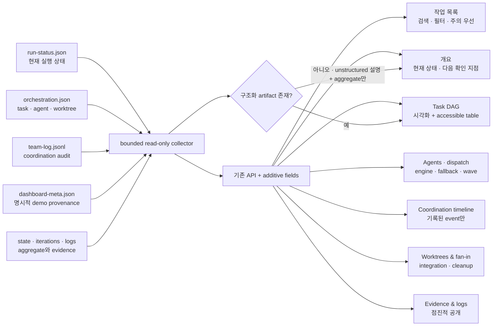

# 스펙: autoloop 대시보드 운영자 UX 개편

- 날짜: 2026-08-19 / 상태: 확정(미구현)
- 관련: `docs/specs/2026-08-19-autoloop-dashboard.md`, `docs/specs/2026-08-19-autoloop-orchestration-runtime.md`, ADR 047·048·049

## 배경

현재 autoloop 대시보드는 새 구조화 실행의 task DAG·agent·dispatch·integration·worktree·evidence를 읽기 전용으로 투영한다. 그러나 정보가 표와 원시 기록에 가깝게 나열되어 운영자가 현재 실행, 차단 원인, 병렬·대기 관계, writer worktree와 fan-in 결과를 빠르게 훑기 어렵다. `team-log.jsonl`도 화면에 없어 선행 task 완료와 후속 dispatch 같은 기록된 흐름을 시간순으로 확인할 수 없다.

과거 실행은 `run-status.json`·`orchestration.json`이 없어 구조화 필드가 없다. 이를 오류처럼 보이게 하거나 현재 스키마로 추정 복원하면 실제 기록과 추론이 섞인다. 따라서 기존 관측·안전 계약을 유지하면서 현재 상태와 주의 지점을 우선하는 운영자 중심 정보 구조로 개편한다.

## 목표

- 첫 화면에서 실행 중·차단·실패·갱신 지연 작업과 다음 확인 지점을 빠르게 찾는다.
- task 의존성, agent/engine, 병렬 dispatch, writer worktree, integration과 검증 증거를 한 흐름으로 추적한다.
- `team-log.jsonl`을 coordination timeline으로 보여 주되 기록에 없는 대화나 내부 추론을 만들지 않는다.
- legacy 작업은 구조화 기록이 없다는 이유와 현재 확인 가능한 aggregate 정보를 구분한다.
- 키보드·스크린리더·좁은 화면에서도 핵심 상태와 상세 정보에 접근한다.
- loopback·읽기 전용·무의존성·bounded read 안전 계약과 API 호환성을 보존한다.

## 비목표

- agent 간 자유 대화, direct message, ask/reply 프로토콜을 만들지 않는다.
- scheduler, task DAG 생성, writer worktree 생성·fan-in·cleanup 정책을 바꾸지 않는다.
- 시작·재시도·중단·승인·삭제 같은 제어 기능을 제공하지 않는다.
- 과거 작업의 누락된 DAG·agent·메시지를 추정하거나 소급 생성하지 않는다.
- npm, 프런트엔드 프레임워크, CDN, 그래프 라이브러리, 데이터베이스를 도입하지 않는다.
- loopback 밖 원격 접속, 인증, 멀티테넌시를 추가하지 않는다.

## 요구사항

- **R1 (운영 질문 중심 정보 구조)**: 작업 목록과 선택 작업 상세의 master-detail 구조를 유지한다. 목록 상단에 전체·실행 중·주의 필요·완료·unstructured tracking 수를 요약하고, 상세에는 `개요`, `Task DAG`, `Agents`, `Coordination`, `Worktrees & fan-in`, `Evidence & logs` 영역을 둔다.
- **R2 (주의 우선 목록)**: 기본 정렬의 첫 축은 구조화 기록 유무가 아니라 운영 상태다. 차단·실패·중단, 갱신이 오래된 실행 중 작업, 정상 실행, 완료 순이며 각 묶음은 최신 갱신 순이다. tracking·provenance는 배지·필터·동률 보조축으로만 쓴다. 검색, 상태/tracking/provenance 필터, 정렬 변경과 결과 수를 제공한다.
- **R3 (상태와 신선도)**: 색만으로 상태를 구분하지 않고 아이콘·텍스트 라벨을 함께 사용한다. 상대·절대 갱신 시각을 제공하고 stale 기준을 넘은 실행은 “갱신 지연”으로 표시하되 실패로 단정하지 않는다.
- **R4 (선택과 자동 갱신)**: 폴링 뒤에도 선택 작업, 상세 영역, 포커스를 유지한다. 선택 작업이 사라지면 목록으로 복귀해 알린다. 자동 갱신 일시정지·재개, 마지막 성공 갱신 시각, 실패·재시도 상태를 제공한다.
- **R5 (Task DAG)**: task 상태, 역할, `depends_on`, 실행 가능 여부, 차단 사유를 DAG로 표시한다. 같은 정보를 키보드로 탐색 가능한 표 또는 순서 목록으로 항상 제공하며 cycle·누락 dependency 진단은 정상 그래프로 꾸미지 않는다.
- **R6 (Agent·engine 추적)**: agent별 task, 역할, 상태, requested/effective engine, fallback 사유, wave, 시작·완료 시각을 표시한다. engine fallback은 성공 여부와 별개인 실행 경로 변경으로 표현한다.
- **R7 (병렬 dispatch)**: 같은 wave의 독립 task를 묶고 dependency 대기와 agent budget 직렬화를 구분한다. 기록에 있는 fallback reason만 표시하고 이유를 추정하지 않는다.
- **R8 (Worktree와 fan-in)**: writer별 worktree 경로, base/commit, retained cleanup 상태, integration 결과, target fast-forward 여부를 표시한다. 경로는 복사만 허용하고, 충돌·hook·승격 실패는 task와 integration 단계에 연결한다.
- **R9 (Coordination timeline)**: `team-log.jsonl`의 허용 event를 시간순으로 투영한다. 시각, event kind, actor/agent, task, wave, 결과 요약, evidence를 표시한다. 현 스키마에서 감사 가능한 것은 선행 task 완료 event 뒤 후속 task가 dispatch된 순서이며, dependency evidence가 prompt에 전달됐다는 사실은 별도 event로 기록되지 않는다. 따라서 이를 “결과 전달”이나 “채팅”으로 부르지 않고, 기록에 없는 메시지·추론·직접 대화를 생성하지 않는다.
- **R10 (bounded event·metadata 수집)**: `team-log.jsonl`과 `dashboard-meta.json`은 작업 경계·심볼릭 링크 방어를 적용한다. event log는 뒤에서부터 제한 바이트와 최대 event 수만 읽고, 손상 줄은 전체 응답을 깨뜨리지 않은 채 diagnostics에 개수와 안전한 위치 정보만 남긴다. 허용 스키마 밖 필드는 화면 데이터로 승격하지 않는다.
- **R11 (tracking·legacy·demo)**: 기존 API의 `source`(`run-status | legacy`, `run-status.json` 존재 여부)는 의미를 바꾸지 않는다. 별도 additive `tracking`(`structured | unstructured`, `orchestration.json` 존재 여부)과 `provenance`(`recorded | demo`)를 둔다. `tracking=unstructured`는 `legacy tracking` 배지와 “이 실행 당시 구조화 추적이 기록되지 않음” 설명을 표시하되 aggregate 정보는 유지한다. `demo`의 유일한 정본은 작업 디렉터리의 bounded `dashboard-meta.json` `{ "schema_version": 1, "provenance": "demo" }`이며, 파일 부재는 `recorded`다. 이름·경로·내용으로 demo를 추정하지 않고 unstructured 데이터로 구조화 정보를 복원하지 않는다.
- **R12 (점진적 공개·반응형)**: 상태·단계·갱신·테스트·남은 항목·주의 이유를 먼저 보여 주고 원시 로그·긴 경로·상세 evidence는 접는다. 넓은 화면은 목록과 상세을 함께, 좁은 화면은 목록→상세 순차 탐색을 제공한다.
- **R13 (접근성)**: 모든 동작 요소는 키보드로 사용할 수 있고 accessible name과 보이는 focus indicator를 가진다. 선택·필터 결과·갱신 실패·선택 소멸을 적절한 ARIA 상태나 live region으로 알린다. reduced motion, 충분한 명암, 200% 확대를 지원한다.
- **R14 (보안·호환·최소 구현)**: `127.0.0.1` bind, Host/method/path/symlink 방어, 읽기 전용 endpoint, CSP·`nosniff`·`no-store`, `textContent`, bounded read를 유지한다. 기존 API 필드를 삭제하거나 의미 변경하지 않고 additive로 확장하며 Python 표준 라이브러리와 현재 단일 HTML/CSS/JS 구조를 유지한다.
- **R15 (검증 가능성)**: 수집·정렬·필터·stale·legacy·timeline·DAG fallback·접근성 상태를 자동 테스트로 고정한다. structured·legacy fixture를 브라우저 smoke test에 함께 쓰고, 독립 리뷰는 이 스펙과 ADR 047·048의 계약을 함께 판정한다.

## 인터페이스 / 설계 개요

`orchestration.json`은 현재 graph projection, `team-log.jsonl`은 append-only coordination audit, `run-status.json`은 현재 실행 상태, 나머지 state·iteration·text 파일은 aggregate와 증거다. 수집기는 이 역할을 합치지 않고 표시용 view model만 만든다.

- 목록 view model은 `attention_rank`, `freshness`, 기존 `source`, additive `tracking`·`provenance`, `status_label`, `attention_reason`을 제공할 수 있으나 scheduler 판정에 쓰지 않는다.
- 상세 API의 기존 배열은 유지하고 coordination은 bounded `events`, `events_truncated`, `event_diagnostics` 같은 additive 필드로 제공한다.
- stale 기준은 표시 상수 하나로 정의해 경계값을 테스트한다. 이는 관측 경고이며 autoloop 종료·정체 gate를 대체하지 않는다.

## 완료 기준 (테스트 가능한 형태)

- [ ] **C1 (R1·R2)**: structured·unstructured 각각의 blocked·stale-running·running·done과 interrupted unstructured fixture에서 운영 상태가 tracking보다 먼저 정렬된다. 요약 수와 검색·상태/tracking/provenance 필터·결과 수가 일치한다.
- [ ] **C2 (R3)**: 모든 상태에 아이콘과 텍스트 라벨이 있고 상대·절대 갱신 시각을 함께 제공한다. stale 경계 직전·경계·직후 테스트가 실패와 분리된 “갱신 지연”을 검증한다.
- [ ] **C3 (R4)**: 폴링 후 선택·상세·포커스가 유지되고 일시정지 중 요청이 없으며 재개 시 다시 갱신한다. 작업 소멸·API 실패·회복 알림과 마지막 성공 갱신 시각이 정확하다.
- [ ] **C4 (R5)**: branching fixture가 DAG와 accessible table에 같은 task·edge·상태·readiness·block reason을 표시하고 cycle·누락 dependency는 정상 DAG로 렌더링되지 않는다.
- [ ] **C5 (R6·R7)**: 독립 task는 같은 wave, dependent task는 후속 wave로 보인다. agent role·시작/완료 시각, engine과 fallback·budget 직렬화 사유는 기록값과 같고 누락값을 추정하지 않는다.
- [ ] **C6 (R8)**: writer 두 개와 integration 성공 fixture가 각 worktree 경로·base commit·task commit·integration commit·target fast-forward 결과·cleanup retained 상태를 표시한다. 충돌·hook·승격 실패 fixture는 task와 정확한 fan-in 단계에 연결되고 경로는 복사만 가능하다.
- [ ] **C7 (R9·R10)**: 허용 event가 시간순으로 task/wave/evidence에 연결되고 선행 완료→후속 dispatch 순서만 보여 준다. 손상 줄·초과 event·초과 바이트에도 응답은 성공하며 diagnostics와 truncation이 남는다.
- [ ] **C8 (R9)**: UI는 coordination timeline 또는 조정 기록 명칭을 쓰고, dependency evidence 전달·대화·추론·메시지를 관찰됐다고 생성하는 코드 경로가 없다.
- [ ] **C9 (R10·R11)**: 기존 `source` 회귀값은 유지되고 `tracking`은 `orchestration.json` 존재 여부로 정해진다. bounded regular file인 `dashboard-meta.json`의 정확한 schema/version/value만 `demo`가 된다. 파일 부재·이름/경로 암시·malformed·oversized·symlink·알 수 없는 version/value는 `recorded`를 유지하고 diagnostics를 남기며 작업 상세 응답을 깨뜨리지 않는다. unstructured fixture는 설명과 aggregate를 표시하되 구조화 영역을 오류처럼 만들지 않는다.
- [ ] **C10 (R12)**: 1440px와 390px smoke test에서 핵심 상태를 먼저 읽고 로그·긴 경로·상세 evidence는 초기 접힘 상태에서 명시적 조작으로 펼친다. 좁은 화면에서 목록으로 복귀할 수 있고 문서 전체 가로 스크롤이 없다.
- [ ] **C11 (R13)**: 표준 라이브러리 테스트가 정적 DOM의 landmark·label·ARIA 연결·focus target·`innerHTML` 부재를 검사한다. 실제 브라우저에서 검색·필터·정렬·선택·상세·자동 갱신을 키보드만으로 수행하고 accessibility tree와 focus order를 수동 기록했을 때 blocker가 없다.
- [ ] **C12 (R13)**: 200% 확대와 reduced-motion 환경에서 내용 손실·동작 불가가 없고 상태·focus·본문 텍스트가 WCAG AA 명암을 충족한다.
- [ ] **C13 (R14)**: 기존 dashboard 회귀와 API 필드가 유지된다. POST·OPTIONS·비-loopback Host·경로 탐색·심볼릭 링크 거부, 보안 헤더, `innerHTML` 부재가 유지된다.
- [ ] **C14 (R14)**: npm·외부 프레임워크·CDN·그래프 의존성 및 상태 변경 endpoint가 없다.
- [ ] **C15 (R15)**: 실제 브라우저 smoke 기록에 목록, DAG/table, agent/engine, coordination, worktree/fan-in, evidence/log, 반응형·키보드 결과가 포함된다.
- [ ] **C16 (전체 검증)**: dashboard·관련 driver 회귀, JavaScript 구문 검사, diagram checker, integrity check, `git diff --check`가 통과하고 독립 reviewer가 이 스펙과 ADR 047·048·049에 PASS한다.

## 미해결 질문

없음. coordination은 기록된 coordinator event의 timeline이며 채팅 UI로 확장하지 않는다. legacy는 추정 복원하지 않고, 외부 UI 의존성 없이 접근 가능한 표 fallback을 제공한다.

## 변경 이력

| 날짜 | 변경 내용 | 대상 | 사유 |
|---|---|---|---|
| 2026-08-19 | 최초 확정 | autoloop 대시보드 운영자 UX | 다음 세션 구현 전에 정보 구조·coordination 의미·legacy·접근성·보안 완료 기준을 단일 정본으로 고정하기 위함 |
