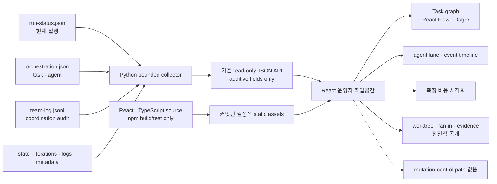

# 스펙: autoloop 대시보드 운영자 UX 개편

- 날짜: 2026-08-19 / 상태: 구현됨
- 관련: `docs/specs/2026-08-19-autoloop-dashboard.md`, `docs/specs/2026-08-19-autoloop-orchestration-runtime.md`, ADR 047·048·049

## 배경

현재 autoloop 대시보드는 새 구조화 실행의 task DAG·agent·dispatch·integration·worktree·evidence를 읽기 전용으로 투영한다. 그러나 정보가 표와 원시 기록에 가깝게 나열되어 운영자가 현재 실행, 차단 원인, 병렬·대기 관계, writer worktree와 fan-in 결과를 빠르게 훑기 어렵다. `team-log.jsonl`도 화면에 없어 선행 task 완료와 후속 dispatch 같은 기록된 흐름을 시간순으로 확인할 수 없다.

과거 실행은 `run-status.json`·`orchestration.json`이 없어 구조화 필드가 없다. 이를 오류처럼 보이게 하거나 현재 스키마로 추정 복원하면 실제 기록과 추론이 섞인다. 따라서 기존 관측·안전 계약을 유지하면서 현재 상태와 주의 지점을 우선하는 운영자 중심 정보 구조로 개편한다.

## 목표

- 첫 화면에서 실행 중·차단·실패·갱신 지연 작업과 다음 확인 지점을 빠르게 찾는다.
- task 의존성, agent/engine, 병렬 dispatch, writer worktree, integration과 검증 증거를 한 흐름으로 추적한다.
- `team-log.jsonl`을 coordination timeline으로 보여 주되 기록에 없는 대화나 내부 추론을 만들지 않는다.
- legacy 작업은 구조화 기록이 없다는 이유와 현재 확인 가능한 aggregate 정보를 구분한다.
- 키보드·스크린리더·좁은 화면에서도 핵심 상태와 상세 정보에 접근한다.
- task 의존 관계를 실제 노드·방향성 edge·결정적 layout으로 시각화한다.
- agent 실행을 활동 lane과 event timeline으로, 측정 비용을 정직한 그래프로 보여 준다.
- Light를 첫 방문 기본값으로 하고 System·Dark 테마를 선택할 수 있게 한다.
- loopback·읽기 전용·bounded read 안전 계약과 API 호환성을 보존한다.
- React·TypeScript 의존성은 빌드에만 사용하고, 커밋된 정적 산출물의 실행에는 Python만 요구한다.

## 비목표

- agent 간 자유 대화, direct message, ask/reply 프로토콜을 만들지 않는다.
- scheduler, task DAG 생성, writer worktree 생성·fan-in·cleanup 정책을 바꾸지 않는다.
- 시작·재시도·중단·승인·삭제 같은 제어 기능을 제공하지 않는다.
- 과거 작업의 누락된 DAG·agent·메시지를 추정하거나 소급 생성하지 않는다.
- CDN·원격 asset·일반 차트 프레임워크·데이터베이스를 도입하지 않는다.
- 기록에 없는 완료율·agent 대화·지속 시간·비용 상한을 추정하지 않는다.
- loopback 밖 원격 접속, 인증, 멀티테넌시를 추가하지 않는다.

## 요구사항

- **R1 (운영 질문 중심 작업공간)**: master-detail 구조를 유지하고 첫 화면에서 “무엇이 실행 중인가, 정상인가, 내가 할 일이 있는가”를 답한 뒤 기술 세부 정보를 공개한다.
- **R2 (주의 우선 목록)**: 차단·실패·중단, stale-running, 정상 running, done 순으로 정렬하고 각 묶음은 최신순으로 둔다. 검색, 상태·tracking·provenance 필터, 대체 정렬, 요약과 결과 수를 제공하며 tracking·provenance는 운영 상태보다 앞서지 않는다.
- **R3 (상태와 신선도)**: 모든 상태를 색상 외 아이콘·텍스트·형태로 구분하고 상대·절대 갱신 시각을 함께 표시한다. stale 경계 이상인 running은 기록 상태를 실패로 바꾸지 않고 “갱신 지연”으로 표시한다.
- **R4 (안정적인 폴링 상호작용)**: 폴링 뒤에도 선택, 열린 상세, scroll과 focus를 가능한 범위에서 유지한다. 자동 갱신 일시정지·재개, 수동 갱신, 마지막 성공, 실패·회복·선택 소멸을 loop 실패와 구분해 알린다.
- **R5 (시각적 개요)**: 선택 작업의 phase, 주의 이유, task 상태 수, 활성 agent, 최신 test, 남은 항목, freshness와 측정 비용을 첫 상세 화면에 요약한다. 기록에 없는 완료율은 표시하지 않는다.
- **R6 (실제 Task DAG)**: 유효한 구조화 실행은 모든 task를 node로, 모든 `dag.edges` 관계를 방향성 edge로 그려 left-to-right 결정적 layout을 제공한다. node는 상태·역할·readiness·blocker를 표시하고 fit·zoom을 제공한다. 동일 관계를 키보드로 읽을 수 있는 목록 또는 표로 항상 제공하며 cycle·누락 dependency는 정상 graph로 꾸미지 않는다.
- **R7 (Agent 활동 lane)**: agent별 task·역할·wave·상태·requested/effective engine·fallback·시작/완료 기록을 lane으로 표시한다. 유효한 양 끝 timestamp가 있을 때만 시간축을 사용하고, 그렇지 않으면 “기록된 순서” 또는 wave 축으로 전환해 지속 시간을 추정하지 않는다.
- **R8 (dispatch와 coordination timeline)**: 같은 wave의 독립 task를 묶고 dependency 대기와 기록된 agent-budget 직렬화를 구분한다. 허용된 `team-log.jsonl` event를 시간순으로 표시하되 chat·추론·direct message·기록되지 않은 결과 전달로 표현하지 않는다.
- **R9 (Worktree와 fan-in 흐름)**: writer worktree를 해당 task와 fan-in 단계에 연결해 path·base/task/integration commit·integration 결과·target fast-forward·실패 단계·retained cleanup을 표시한다. 경로는 복사만 허용한다.
- **R10 (정직한 비용 시각화)**: 누적 비용과 반복별 측정값을 `full`·`partial`·`unavailable`·`unknown` 의미와 함께 숫자·그래프로 표시한다. 미측정 값은 `$0.00`으로 표시하지 않고, 기록된 cap이 없으면 예산 대비 백분율이나 상한선을 만들지 않는다.
- **R11 (bounded artifact 수집)**: `team-log.jsonl`과 `dashboard-meta.json`에 작업 경계·심볼릭 링크 방어를 적용한다. 제한 바이트·event 수만 읽고 손상은 해당 작업 diagnostics로 격리하며 allowlist 밖 필드는 view model로 승격하지 않는다.
- **R12 (tracking·legacy·demo 진실성)**: 기존 `source` 의미를 보존하고 `tracking`은 `orchestration.json`, `provenance=demo`는 정확한 bounded metadata schema만 정본으로 삼는다. unstructured 실행은 aggregate 정보를 유지하고 누락된 agent·edge를 복원하지 않는다.
- **R13 (점진적 공개·반응형)**: 개요·graph/lane 요약·주의 정보를 원시 evidence보다 먼저 둔다. 긴 path·diagnostics·반복 detail·log는 초기 접힘으로 두고, 넓은 화면은 목록+상세, 좁은 화면은 목록→상세 및 accessible DAG 목록 기본값을 제공한다.
- **R14 (테마와 시각 체계)**: semantic token으로 Light·System·Dark를 제공한다. 첫 방문은 Light이며 유효한 local preference만 저장하고 System은 OS 변경을 따른다. 서버에 preference를 쓰지 않는다.
- **R15 (접근성)**: 모든 control·graph affordance·disclosure·filter·selection·copy·theme 선택에 accessible name, visible focus와 keyboard operation을 제공한다. landmark·heading·live region·reduced motion·200% 확대·WCAG AA 명암과 graph의 동등한 비시각 관계 view를 완료 조건으로 둔다.
- **R16 (React·TypeScript 빌드 경계)**: strict TypeScript·React·Vite로 frontend를 작성하고 결정적 production build를 커밋한다. Node/npm은 개발·빌드·테스트에만 사용하며 정상 dashboard 실행은 `python3 dashboard.py`만 요구하고 Node process·CDN·remote asset을 사용하지 않는다.
- **R17 (로컬 읽기 전용 보안·호환)**: `127.0.0.1`, loopback Host, method/path/symlink 방어, bounded read, CSP·`nosniff`·`no-store`·referrer policy와 기존 JSON 의미를 보존한다. Python은 고정된 build asset route만 제공한다. 외부 문자열은 escaped React text child로만 렌더링하고 unsafe HTML·parsing·실행·style·URL sink를 금지한다.
- **R18 (최소 의존성)**: runtime frontend 의존성은 React·React DOM·`@xyflow/react`·`@dagrejs/dagre`로 제한한다. timeline·lane·status·cost는 platform·CSS·SVG로 만들고 router·상태관리·chart·icon·CSS-in-JS·schema framework를 추가하지 않는다.
- **R19 (검증 표면)**: Python collector·security 회귀를 유지하고 inline string 검사는 TypeScript unit/component test로 대체한다. structured·unstructured·corrupt fixture와 실제 browser smoke를 추가하며 독립 review는 이 스펙과 ADR 047·048·049를 함께 판정한다.

## 인터페이스 / 설계 개요

artifact 역할은 바꾸지 않는다. Python은 bounded artifact 수집·JSON API·고정 static asset 제공을 맡고, React는 표시와 browser-local 상호작용만 맡는다. build 결과는 저장소에 커밋되어 실행 시 Node가 필요하지 않다.

- frontend source와 lockfile은 `.agents/skills/autoloop/dashboard-ui/`에 두고 `dist/index.html`, `dist/assets/app.js`, `dist/assets/app.css`를 결정적 이름으로 생성한다.
- `dashboard.py`는 자신의 real path를 기준으로 dist root를 찾고 `/`, `/assets/app.js`, `/assets/app.css`만 정확한 MIME으로 제공한다. 일반 directory server나 SPA catch-all은 두지 않는다.
- CSP는 외부 script·connection을 차단한다. React Flow layout에 필요한 style attribute를 허용하되 artifact text는 style·URL에 전달하지 않는다.
- 목록 view model의 `attention_rank`·freshness·`source`·`tracking`·`provenance`는 scheduler 판정에 쓰지 않는다. stale는 관측 경고이며 loop gate가 아니다.

## 완료 기준 (테스트 가능한 형태)

- [x] **C1 (R1·R2)**: structured·unstructured blocked, stale-running, running, done, interrupted fixture를 읽으면 운영 상태가 tracking·provenance보다 먼저 정렬되고 summary·filter·대체 sort·결과 수가 fixture와 일치한다.
- [x] **C2 (R3)**: 지원 상태와 stale 경계 직전·경계·직후를 렌더링하면 각 상태에 비색상 cue와 상대·절대 시각이 있고 stale-running의 기록 상태는 running으로 남는다.
- [x] **C3 (R4)**: poll update·failure·recovery·pause·resume·selection removal을 실행하면 가능한 selection·disclosure·scroll·focus가 유지되고 pause 중 요청이 없으며 refresh 상태를 loop 상태로 오인하는 알림이 없다.
- [x] **C4 (R5)**: 완료율이 기록되지 않은 혼합 상태 task를 선택하면 첫 detail viewport에 phase·attention·task count·active agent·test·remaining·freshness·cost가 보이고 percent-complete는 없다.
- [x] **C5 (R6)**: branching DAG fixture를 렌더링하면 정확한 task node와 방향성 edge가 있고 predecessor가 dependent보다 앞 rank에 놓인다. cycle·missing dependency fixture는 정상 graph 대신 diagnostics를 표시한다.
- [x] **C6 (R6·R15)**: graph를 사용하지 않아도 keyboard-readable 관계 view에서 동일 node ID·edge endpoint·상태·readiness·blocker를 읽을 수 있고 fit·zoom control에 accessible name과 visible focus가 있다.
- [x] **C7 (R7)**: 유효 timestamp fixture는 실제 시간축에, missing·invalid timestamp fixture는 명시된 wave·기록 순서축에 agent lane을 놓는다. 두 경우 task·role·wave·status·engine·fallback·기록 endpoint가 API와 같고 추정 duration이 없다.
- [x] **C8 (R8)**: independent·dependent·budget-serialized wave와 허용 event를 렌더링하면 같은 wave가 묶이고 기록된 wait·fallback만 구분되며 event가 시간순이다. dependency 대기는 `ready=false`이고 collector가 dependency 대기로 기록한 task만 별도 표시하며, 완료된 선행 task가 있는 dispatched task의 일반 `depends_on`·비dependency blocker를 현재 대기로 재해석하지 않는다. chat·reasoning·direct message·미기록 결과 전달을 주장하는 UI 문자열이나 code path가 없다.
- [x] **C9 (R9)**: writer 두 개와 성공·실패 integration fixture를 렌더링하면 task가 정확한 path·base/task/integration commit·fast-forward·cleanup·failure stage와 연결되고 path 동작은 copy뿐이다. integration은 대응 worktree row의 존재와 무관하게 자체 행으로 렌더링해, worktree가 남지 않은 실패 wave도 숨기지 않는다.
- [x] **C10 (R10)**: full·partial·unavailable·unknown cost fixture를 렌더링하면 graph와 text가 측정값에만 기반하고 incomplete 의미가 드러난다. unavailable·unknown은 `$0.00`이 아니며 recorded cap 없이는 percent·budget line이 없다.
- [x] **C11 (R11)**: event·metadata가 oversized·malformed·unsupported·symlink이면 나머지 task API는 성공하고 byte·event limit, diagnostics·truncation이 남으며 allowlist 밖 필드가 노출되지 않는다.
- [x] **C12 (R12)**: exact·missing·malformed·oversized·symlink·misleading-name fixture를 읽으면 기존 `source`가 유지되고 tracking·provenance는 명시 artifact만 따른다. unstructured 실행은 aggregate를 유지하고 node·agent를 만들지 않는다.
- [x] **C13 (R13)**: 1440px·390px browser smoke에서 overview·attention·primary visualization이 collapsed raw detail보다 앞서고 mobile에서 목록으로 돌아가며 좁은 화면은 dependency list가 기본이고 document horizontal overflow가 없다.
- [x] **C14 (R14)**: Light·Dark·System을 선택하면 semantic token이 해석되고 첫 방문은 Light이며 유효 mode만 지속된다. System은 OS 변경을 따르고 server preference mutation은 없다.
- [x] **C15 (R15)**: keyboard-only·200% zoom·reduced motion으로 동작하면 모든 path가 사용 가능하고 focus·live update가 정확하며 automated accessibility serious/critical finding이 없고 theme/state text와 focus가 WCAG AA를 충족한다.
- [x] **C16 (R16·R18)**: lockfile 기준으로 typecheck·test·build하면 `dist/index.html`, `assets/app.js`, `assets/app.css`가 결정적으로 생성된다. Node를 `PATH`에서 제거해도 `python3 dashboard.py`가 같은 build를 CDN·remote request 없이 제공한다.
- [x] **C17 (R17)**: root·API·asset·error route를 요청하면 loopback Host, read-only method, fixed static confinement, symlink/path traversal, MIME, CSP, `nosniff`, `no-store`, referrer header가 통과한다. 앱 소유 source와 렌더 경로에서 외부 artifact가 unsafe HTML·실행·style·URL sink로 흐르지 않으며, dependency bundle 내부 API 이름의 단순 문자열 부재를 완료 조건으로 삼지 않는다.
- [x] **C18 (R19)**: structured·unstructured·corrupt·attention fixture를 unit/component·real browser로 실행하면 list·overview·graph/list·agent lane·coordination·cost·worktree/fan-in·evidence·polling·theme·responsive·keyboard 동작이 포함된다.
- [x] **C19 (R19)**: 기존 dirty collector 작업을 migration하면 collector·freshness·tracking/provenance·bounded event·DAG validation·worktree/integration·legacy·cost·symlink·JSON·API·driver 회귀가 모두 통과하고 obsolete inline-HTML assertion만 동등 frontend test로 대체된다.
- [x] **C20 (전체)**: Python dashboard·driver, npm typecheck·unit·build, browser smoke·accessibility, diagram, integrity, `git diff --check`를 실행하면 모두 통과하고 independent reviewer가 개정 스펙과 ADR 047·048·049에 PASS한다.

## 미해결 질문

없음. 사용자가 시각화 우선, React·TypeScript, 밝고 친근한 기본 경험을 확정했다. coordination은 기록된 event timeline이며 채팅 UI로 확장하지 않고, legacy는 추정 복원하지 않는다.

## 변경 이력

| 날짜 | 변경 내용 | 대상 | 사유 |
|---|---|---|---|
| 2026-08-19 | 최초 확정 | autoloop 대시보드 운영자 UX | 다음 세션 구현 전에 정보 구조·coordination 의미·legacy·접근성·보안 완료 기준을 단일 정본으로 고정하기 위함 |
| 2026-08-19 | 시각화·TypeScript 개편으로 재확정 | R1~R19·C1~C20·설계 경계 | 사용자가 장식된 표가 아닌 실제 graph·agent 활동·비용 시각화와 밝고 친근한 경험을 명시해, 기존 무빌드·외부 graph 의존성 금지 결정을 부분 대체함 |
| 2026-08-19 | C17 bundle 검사를 trust boundary에 맞게 정교화 | C17 | React DOM dependency bundle에는 내부 sink API 이름이 존재하므로 문자열 0건은 외부 artifact의 실제 흐름을 증명하지 않는다. 앱 소유 source·렌더 경로와 서버 CSP를 검증 대상으로 고정함 |
| 2026-08-19 | 2회 BLOCK 뒤 남은 의미 경계 고정 | C8·C9 | 일반 dependency·blocker를 현재 대기로 오인하지 않고, integration을 worktree 존재 여부에 종속시키지 않도록 재작업 범위를 명시함 |
