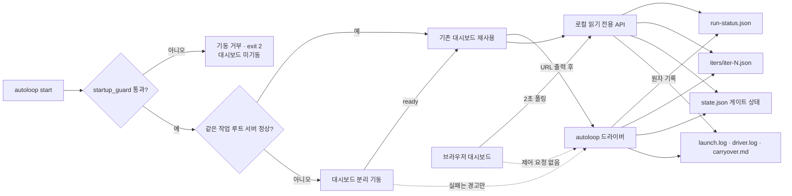

# 스펙: autoloop 로컬 진행 대시보드

- 날짜: 2026-08-19 / 상태: 구현됨
- 관련: `docs/specs/2026-07-19-autoloop-driver.md`, ADR 025, 루트 `AGENTS.md` §3·§13

## 배경

autoloop은 반복별 결과를 `_workspace/autoloop/<작업명>/`에 기록하지만, 사용자가 진행 상황을 보려면 `driver.log`, `state.json`, `iters/`, `carryover.md`를 직접 대조해야 한다. 재기동된 작업은 현재 런과 누적 상태가 섞이고, `driver.pid`는 종료 뒤에도 남으며, `state.json`의 `prev_open`은 정체 판정용 값이라 최신 반복의 표시값으로 사용할 수 없다. 따라서 기존 게이트 상태를 바꾸지 않으면서 관측 전용 상태를 추가하고, 여러 작업을 한 화면에서 읽는 로컬 대시보드가 필요하다.

## 목표

- 사용자가 브라우저 한 화면에서 autoloop 작업별 실행 상태, 단계, 반복, 테스트 결과, 남은 항목, 비용, 차단 사유를 확인한다.
- 현재 런과 누적 이력을 구분하고, 기존 작업 디렉터리도 별도 변환 없이 읽는다.
- 대시보드가 로그나 에이전트 출력을 명령 또는 HTML로 해석하지 않고 로컬에서만 읽는다.
- 관측 상태 기록 실패가 autoloop의 안전·완료 판정을 바꾸지 않는다.

## 비목표

- 일반 orchestrate 팀의 `team-log.jsonl` 통합은 이번 범위에 포함하지 않는다.
- 작업 시작, 재실행, STOP 생성, 프로세스 종료 같은 제어 기능은 제공하지 않는다.
- 에이전트의 내부 추론이나 근거 없는 진행률 백분율은 표시하지 않는다.
- 외부 호스트 공개, 원격 접근, 인증 시스템, 별도 데이터베이스는 도입하지 않는다.
- AgentsView 세션 브라우저를 대체하거나 그 데몬 상태를 복구하지 않는다.

## 요구사항

- **R1 (로컬 서버)**: Python 3 표준 라이브러리만 사용하는 서버가 `127.0.0.1`에만 바인딩되고, 사용자가 포트를 지정할 수 있다.
- **R2 (작업 발견)**: 서버는 지정된 autoloop 작업 루트의 바로 아래 디렉터리만 작업으로 발견하며, 작업 디렉터리뿐 아니라 그 안의 상태·로그·반복 파일과 `iters/` 경로가 심볼릭 링크이면 읽지 않는다.
- **R3 (호환 수집)**: 수집기는 신규 `run-status.json`과 기존 `state.json`, `iters/iter-N.json`, `launch.log`, `driver.log`, `carryover.md`, `driver.pid`를 함께 읽고, 파일 부재·손상·비유한 JSON 숫자(`NaN`·`Infinity`)는 서버 전체 실패가 아니라 해당 작업의 진단 정보로 반환한다.
- **R4 (표시값 우선순위)**: 남은 항목과 테스트 결과는 번호가 가장 큰 `iter-N.json`을 정본으로 사용한다. 그 파일이 손상되면 더 오래된 반복을 최신값으로 승격하지 않고 표시값을 미확인으로 둔다. 누적 반복·비용·기동 횟수는 `state.json`을 사용한다. 현재 런의 단계·PID·종료 사유는 `run-status.json`을 우선하고, 이 파일이 없는 기존 작업은 `launch.log`와 `driver.pid`로 보수적으로 판정한다.
- **R5 (관측 상태 계약)**: 드라이버는 `run-status.json`을 임시 파일과 `os.replace`로 원자 기록한다. 상태에는 스키마 버전, 작업명, 런 번호, PID, 시작·갱신 시각, 현재 런 반복 번호, 누적 반복 번호, 단계, 실행 상태, 종료 사유, 비용 측정 범위, 스펙·프로젝트 경로가 포함된다. 누적 비용의 측정 범위도 `state.json`에 이어받아 재기동이 과거의 미측정 비용을 완전 측정으로 바꾸지 못한다.
- **R6 (단계 갱신)**: 드라이버는 적어도 `starting`, `implementing`, `testing`, `verifying`, `finished` 단계를 기록한다. 기록 실패는 `driver.log`에 경고를 남기고 기존 루프의 종료 사유와 게이트 판정에는 영향을 주지 않는다.
- **R7 (읽기 전용 API)**: `GET /api/tasks`는 최신 반복 하나만 읽은 작업 요약 목록을, `GET /api/tasks/<작업명>`은 최근 반복 최대 200개·차단 노트·로그 꼬리를 포함한 상세를 JSON으로 반환한다. 이력이 잘리면 전체 수와 잘림 여부를 함께 반환한다. 그 밖의 변경 메서드와 경로 탐색 시도는 거부한다.
- **R8 (안전한 화면)**: 화면은 API로 받은 모든 파일·로그 내용을 DOM `textContent`로만 넣고 `innerHTML`을 사용하지 않는다. 서버는 `Host`가 loopback 주소가 아닌 요청을 거부하고, 성공·오류 응답 모두 외부 리소스와 외부 연결을 막는 CSP, `nosniff`, `no-store` 헤더를 포함한다.
- **R9 (사용성)**: 작업 카드는 실행·완료·차단·정체·오류·중단 의심을 구분하고, 현재 단계, 현재/누적 반복, 최신 테스트, 남은 항목, 누적 비용, 마지막 갱신 시각을 표시한다. 상세 화면은 반복 타임라인, 사용자 확인 필요 노트, 로그를 표시한다. 자동 갱신은 사용자가 일시정지·재개할 수 있고, 갱신 뒤 카드의 키보드 포커스와 선택 상태가 유지되며, 사라진 작업의 상세는 즉시 비운다.
- **R10 (비용 의미)**: 비용 정보가 제공되지 않는 엔진은 숫자 0을 실제 무비용으로 표시하지 않고 `측정 안 됨`으로 표시할 수 있도록 누적 상태와 각 반복에 측정 가능 여부를 포함한다.
- **R11 (운영 진입점)**: autoloop 스킬은 `dashboard`·`대시보드` 동사를 인식하고, 대시보드 실행 명령과 로컬 URL, 읽기 전용 범위를 설명한다. 사용자용 한글 요약도 같은 진입점을 제공한다.
- **R12 (자동 기동)**: `start`의 드라이버 사전 검사가 통과하면 드라이버는 작업 루트의 대시보드를 `127.0.0.1:8765`에서 재사용하거나 분리 프로세스로 기동한다. 포트는 `--dashboard-port`로 바꿀 수 있다. 대시보드는 루프가 끝난 뒤에도 완료 이력을 볼 수 있도록 유지한다.
- **R13 (실패 격리)**: 대시보드 포트가 다른 프로세스에 점유됐거나 대시보드 프로세스를 기동할 수 없어도 경고와 로그 경로를 남길 뿐 autoloop의 기동·종료 사유·반환 코드를 바꾸지 않는다.
- **R14 (요구사항 분해)**: autoloop 구현 반복은 편집 전에 스펙의 완료 기준을 실행 가능한 작업으로 나누고, 각 작업에 완료 기준 번호, `depends_on`, 기대 검증 증거를 연결한다. 이 작업 지도는 carryover의 `진행 중 · 다음 할 일`에 유지하며 매 반복 가장 작은 미차단 작업 하나를 선택한다.

## 인터페이스 / 설계 개요

표시용 `run-status.json`은 게이트용 `state.json`과 분리한다. 전자는 화면이 읽는 현재 런 스냅샷이고, 후자는 재기동 시 정체·예산·피드백을 이어받는 판정 상태다. 대시보드는 표시를 위해 `state.json.prev_open`을 재해석하지 않는다.

- `GET /api/tasks`
  - 응답: `{ "tasks": [<요약>], "generated_at": <ISO8601> }`
- `GET /api/tasks/<작업명>`
  - 응답: 요약 필드 + `iterations`, `carryover`, `log_tail`, `diagnostics`
- `run-status.json`
  - `status`: `running | finished`
  - `phase`: `starting | implementing | testing | verifying | finished`
  - `exit_reason`: 실행 중에는 빈 문자열, 종료 뒤에는 autoloop의 일곱 종료 사유 중 하나

## 완료 기준 (테스트 가능한 형태)

- [x] **C1 (R1)**: 포트 `0`으로 서버를 기동하면 실제 할당된 포트에서 응답하고, 기본 바인드 주소는 `127.0.0.1`이다.
- [x] **C2 (R2)**: 작업 디렉터리·상태 파일·텍스트 파일·`iters/`가 작업 경계 밖을 가리키는 심볼릭 링크이면 내용을 반환하지 않고, `/api/tasks/../...` 요청도 거부한다.
- [x] **C3 (R3·R4)**: `state.json.prev_open=5`이고 최신 반복이 `open_items=0`, `test=green`이면 API는 남은 항목 0과 green을 표시한다.
- [x] **C4 (R3·R4)**: JSON 하나가 손상되거나 비유한 숫자를 포함해도 다른 작업은 정상 응답하고, 손상된 작업은 `diagnostics`에 파일명과 읽기 실패를 남긴다. 가장 최신 반복이 손상되면 이전 반복의 값을 최신값으로 표시하지 않는다.
- [x] **C5 (R5)**: `run-status.json` 기록 중 `os.replace`를 실패시키면 대상 파일에 부분 JSON이 생기지 않고 임시 파일도 정리된다.
- [x] **C6 (R6)**: 정상 완료 실행은 `starting → implementing → testing → verifying → finished` 단계를 기록하고, 최종 상태에 `done`이 남는다.
- [x] **C7 (R6)**: 관측 상태 기록을 실패시키면 드라이버는 경고를 기록하면서 원래 종료 사유로 끝난다.
- [x] **C8 (R7·R8)**: 목록 API와 상세 API는 JSON을 반환하고, POST·OPTIONS·등록되지 않은 작업명·loopback이 아닌 Host는 403·404·405로 거부한다.
- [x] **C9 (R8)**: HTML은 동적 데이터 삽입에 `textContent`를 사용하고 `innerHTML`을 포함하지 않으며, 성공·404·405 응답에 CSP·`nosniff`·`no-store`가 설정된다.
- [x] **C10 (R7·R9)**: 샘플 작업을 읽은 화면 데이터에는 상태, 단계, 반복, 테스트, 남은 항목, 비용, 갱신 시각, 반복 이력, carryover, 로그가 포함된다. 상세 이력은 200개로 제한되고 잘림을 표시하며, 자동 갱신은 일시정지·포커스 복원·사라진 선택 초기화를 지원한다.
- [x] **C11 (R10)**: Codex처럼 비용을 제공하지 않는 작업은 누적값과 반복별 값 모두 비용 측정 불가로 구분되어 화면에 `$0.00`이 아닌 `측정 안 됨`으로 표시된다. 같은 작업명을 Claude로 재기동해도 과거 미측정 범위가 완전 측정으로 승격되지 않는다.
- [x] **C12 (R11)**: autoloop 스킬과 한글 요약에 같은 대시보드 실행 명령이 있고, 해당 명령의 `--help`가 성공한다.
- [x] **C13 (전체 회귀)**: `driver_test.py` 101건, `dashboard_test.py` 19건, 다이어그램 검사 1블록, 하네스 무결성 검사 55건이 모두 통과한다.
- [x] **C14 (R12)**: 같은 작업 루트에서 드라이버를 두 번 기동하면 첫 기동은 대시보드 프로세스를 시작하고 두 번째 기동은 같은 서버를 재사용하며, 두 경우 모두 같은 로컬 URL을 보고한다. 성공 URL은 `nohup` 리다이렉션에서도 기동 직후 `launch.log`에 출력된다.
- [x] **C15 (R13)**: 대시보드 프로세스 기동을 실패시키면 경고가 출력되지만 `Driver.run()`이 실행되고 원래 루프 종료 결과에 해당하는 반환 코드가 유지된다.
- [x] **C16 (R14)**: 구현 반복 프롬프트와 orchestrate 절차가 완료 기준 번호, 실행 작업, `depends_on`, 기대 검증 증거의 매핑을 요구하고, autoloop 프롬프트 회귀 테스트가 이를 고정한다.

## 미해결 질문

없음.

## 변경 이력

| 날짜 | 변경 내용 | 대상 | 사유 |
|---|---|---|---|
| 2026-08-19 | 최초 확정 | autoloop 진행 대시보드 | 사용자가 무인 작업의 진행 상황을 브라우저에서 확인하도록 요청함 |
| 2026-08-19 | 구현·독립 검증 완료 | 이 문서, autoloop 드라이버·대시보드·테스트·스킬 | 1차 통합 BLOCK의 must-fix 8건·should-fix 5건을 반영하고 세 관점 델타 검토와 통합 판정 PASS를 받음 |
| 2026-08-19 | 자동 대시보드 기동과 요구사항 작업 지도 추가 | `.agents/skills/{autoloop,orchestrate}/SKILL.md`, `.agents/skills/autoloop/scripts/{driver.py,driver_test.py,dashboard.py,dashboard_test.py}`, `.agents/skills/README.ko.md`, `.agents/agents/{architect.md,README.ko.md}`, `docs/specs/2026-07-19-autoloop-driver.md`, `docs/adr/{025-autoloop-driver.md,047-autoloop-observation-dashboard.md}`, `docs/harness-changelog.md`, `_workspace/{autoloop-auto-dashboard-review,harness-ops-log.md}` | 사용자가 autoloop 시작과 동시에 진행 화면이 열리고, 무인·오케스트레이션 실행 모두 완료 기준을 실제 작업과 증거로 분해하도록 요청함 |
