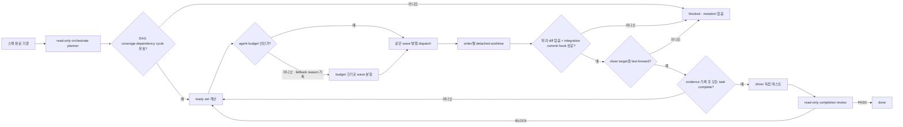

# 스펙: autoloop 구조화 오케스트레이션 런타임

- 날짜: 2026-08-19 / 상태: 구현됨
- 관련: `docs/specs/2026-07-19-autoloop-driver.md`, `docs/specs/2026-08-19-autoloop-dashboard.md`, `docs/specs/2026-08-03-autoloop-engine-harness-load-symmetry.md`, ADR 025·047·048, `_workspace/autoloop-orchestration-review/phase2_integrator_verdict.md`

## 배경

현재 autoloop은 한 번에 구현 세션 하나를 실행하고, 완료 기준과 작업의 연결을 carryover 자유 형식 문장으로만 요구한다. 이 구조는 안전한 순차 루프와 loop 단위 worktree는 제공하지만, `orchestrate` 판정·구조화된 task DAG·ready-task 병렬 dispatch·concurrent writer 격리·agent/task 관측을 실행 계층에서 강제하지 않는다. 독립 검토는 이 공백을 must-fix 5건으로 판정했다.

## 목표

- 첫 제품 mutation 전에 autoloop이 `orchestrate` 판정·agent 예산·완료 기준 전체를 덮는 task DAG를 기록한다.
- 의존성이 끝난 ready task는 같은 scheduling wave에서 병렬 실행한다.
- 같은 저장소를 동시에 수정하는 writer는 task별 Git worktree에서 실행하고, fan-in은 충돌 검사를 통과한 patch만 대상 worktree에 반영한다.
- Claude와 Codex가 같은 최소 오케스트레이션 계약을 받으며, Codex의 작업 루트와 sandbox 쓰기 범위는 대상 worktree 아래로 유지한다.
- 로컬 대시보드가 task·dependency·agent·dispatch·worktree·evidence 상태를 읽기 전용으로 표시한다.

## 비목표

- 일반 `orchestrate` 팀 실행기를 autoloop driver로 대체하지 않는다. driver는 무인 실행에 필요한 최소 계약만 강제한다.
- child worktree를 무인으로 삭제하지 않는다. fan-in 이후에도 경로와 cleanup 상태를 기록하고, 확인된 정리는 대화형 `branch-workflow`가 맡는다.
- merge conflict를 모델에게 자동 해결시키지 않는다. fan-in 충돌은 `blocked`로 종료한다.
- dashboard에 시작·중지·재시도·파일 변경 endpoint를 추가하지 않는다.
- 인프라·배포 spec을 autoloop 대상으로 허용하지 않는다.

## 요구사항

- **R1 (orchestrate runtime gate)**: 첫 mutation 전에 read-only planner 세션을 실행한다. 세션은 `orchestrate` verdict, 근거, agent-call budget, 완료 기준 목록, task DAG를 구조화 출력한다. 이 기록이 없거나 유효하지 않으면 worktree 생성·구현 session·제품 파일 변경 없이 `blocked`로 끝난다.
- **R2 (구조화 task DAG)**: `orchestration.json`은 schema version, spec criterion IDs, orchestrate verdict·budget, task 목록, 선점 저장된 wave reservation, dispatch wave, integration·cleanup 기록을 갖는다. 각 task는 task ID, criterion IDs, 하나의 deliverable, `depends_on`, owner, mode, mutability, expected/observed evidence, status를 갖는다.
- **R3 (DAG 검증)**: driver는 spec의 완료 기준 ID 전체 coverage, 미지 criterion, 중복 task ID, unknown/self dependency, cycle, 빈 deliverable/evidence, 허용되지 않은 상태·mode·mutability를 검사한다. mutation 전과 `done` 수락 전에 모두 검사한다.
- **R4 (ready-set scheduling)**: dependency가 모두 `complete`인 `pending` task만 ready다. 같은 wave의 독립 task는 agent budget 범위에서 동시에 dispatch한다. budget·비-Git writer·기타 격리 불가 때문에 직렬화하면 구조화된 fallback reason을 남긴다. dependency가 남은 task는 dispatch하지 않는다.
- **R5 (writer worktree isolation)**: writer 수와 무관하게 모든 mutating task를 대상 HEAD에서 만든 task별 detached child worktree에 bind한다. task ID·agent ID·path·base commit을 기록한다. mapping이 없거나 같은 path가 두 writer에 배정되면 dispatch를 거부한다.
- **R6 (fan-in)**: 각 writer 결과는 base commit 대비 binary patch로 수집한다. 별도 integration worktree에서 task ID 순으로 patch를 적용해 충돌을 검사하고 combined result를 그 worktree에서 먼저 commit한다. commit hook까지 성공한 뒤 대상 worktree가 여전히 clean이고 base HEAD인 경우에만 검증된 commit으로 fast-forward한다. 충돌·빈 writer patch·hook·승격 실패는 `blocked`이며 대상 HEAD·index·working tree에 부분 fan-in을 남기지 않는다.
- **R7 (engine symmetry + launcher inheritance)**: Claude와 Codex의 planner·worker·reviewer prompt에는 versioned bounded orchestrate contract를 주입한다. `--engine`을 생략하면 driver는 launcher 환경을 감지해 Codex 세션에서는 Codex, Claude 세션에서는 Claude를 선택하며, 명시한 `--engine`·역할별 override가 우선한다. 판별 표지가 없으면 기존 호환성을 위해 Claude를 택한다. Codex read-only 세션은 `-C <task worktree>`, `--sandbox read-only`, writer는 격리된 task worktree를 `-C`로 고정한 `--sandbox workspace-write`를 사용한다. 둘 다 `--ignore-user-config`, `approval_policy="never"`, core 환경변수만 상속, `sandbox_workspace_write.network_access=false`를 고정하고 루트 하네스 자동 로드·`--add-dir`·bypass에 기대지 않는다. Codex writer patch는 fan-in 전에 삭제·rename·파일 타입 변경·symlink·submodule을 기계적으로 거부한다. 정상 파일 편집·추가는 R6의 integration worktree와 commit hook을 통과해야만 대상 worktree로 승격된다.
- **R8 (event audit)**: driver는 `team-log.jsonl`에 `team_create`, `task_dispatch`, `task_complete|task_failed`, `integration_complete`, `shutdown_request`, `team_delete`를 발생 즉시 append한다. 같은 wave의 느린 agent를 기다리지 않고 future 완료 순서대로 task state·event를 원자 저장한다. task event에는 criterion IDs, agent ID, dependency, worktree, started/finished time, evidence pointer를 포함한다.
- **R9 (completion review)**: 테스트 green 뒤 read-only reviewer는 spec criteria뿐 아니라 orchestration verdict·coverage·DAG validity·ready-set dispatch record·writer isolation·fan-in·evidence를 감사한다. 구조화 기록이 하나라도 빠지면 PASS할 수 없다.
- **R10 (dashboard projection)**: API summary는 task·agent 상태 집계를, detail은 task graph·agents·dispatch/fallback·integration·worktree cleanup 이력을 반환한다. 화면은 task ID, criterion IDs, dependency, owner/agent, status, blocker, 시작·종료 시각, worktree label, evidence pointer를 `textContent`로 표시한다.
- **R11 (resume)**: 같은 work-name 재기동은 기존 `orchestration.json`을 검증해 completed task와 dispatch 이력을 이어받는다. complete task에 evidence·dispatch·agent·writer integration이 빠지면 의존 task를 풀지 않는다. 새 wave ID는 worktree 생성보다 먼저 원자 예약하고, reservation·dispatch·integration·worktree에 저장된 최댓값 다음으로 단조 증가한다. 중단된 writer worktree는 cleanup 이력에 보존한 채 새 attempt path를 쓴다. integration commit은 target fast-forward 전에 저장하며, 재기동은 이 commit·base와 clean target HEAD를 대조해 이미 승격된 task를 complete로 복구하고, 미승격 attempt는 보존한 채 새 wave로 넘기며, 분기한 target은 fail-closed한다. 손상·schema 불일치는 zero-state로 낮추지 않고 기동을 거부한다.
- **R12 (표준 라이브러리·안전)**: 구현은 Python 3 표준 라이브러리만 사용한다. child worktree 자동 삭제, force, deploy, push, DB migration을 실행하지 않는다.
- **R13 (agent tier 모델 기록)**: driver는 표준 roster의 owner→tier 매핑을 단일 상수로 유지하고 planner/final reviewer=`design`, task agent=`owner의 tier`로 실행한다. 기동 세션이 현재 CLI 라인업에서 선택해 전달한 `design`·`implement`·`explore` 모델명을 각 task와 agent record의 `model_tier`·`requested_model`·`effective_model`·`model_source`에 저장하고 `task_dispatch` event에도 싣는다. 명시 모델이 없으면 실제 CLI 기본 모델명을 추정하지 않고 빈 `effective_model`과 `cli_default_unreported` source를 기록한다. 손상되거나 알려지지 않은 owner/tier는 임의 모델로 낮추지 않고 orchestration 검증에서 거부한다.

## 인터페이스 / 설계 개요

`orchestration.json`이 scheduling과 dashboard의 공통 정본이다. `team-log.jsonl`은 append-only 감사 흔적이며, `run-status.json`과 `state.json`은 기존 현재 런 관측·재기동 게이트 역할을 유지한다.



최소 task shape은 다음과 같다.

```json
{
  "id": "T1",
  "criterion_ids": ["C1"],
  "deliverable": "한 개의 검증 가능한 산출물",
  "depends_on": [],
  "owner": "implementer",
  "mode": "worker",
  "mutability": "write",
  "expected_evidence": "검증 명령 또는 파일 단언",
  "observed_evidence": "",
  "status": "pending"
}
```

## 완료 기준 (테스트 가능한 형태)

- [x] **C1 (R1·R3)**: planner 출력에서 criterion 하나가 빠지거나, unknown dependency·cycle·중복 task ID가 있으면 구현 session과 `git worktree add`가 0회인 채 `blocked`가 된다.
- [x] **C2 (R1·R7)**: Claude·Codex 양쪽 planner/worker/reviewer prompt에 같은 contract version과 `orchestrate` verdict 의무가 있고, 모순 지시문(`Do not invoke orchestrate`, `Never parallelize`)을 추가해도 driver validation이 우회되지 않는다.
- [x] **C3 (R4)**: 독립 task A·B가 같은 wave에서 실행 interval이 겹치고, A·B에 의존하는 C는 둘이 complete된 다음 wave에서만 dispatch된다.
- [x] **C4 (R5)**: 동시 writer A·B는 서로 다른 worktree path와 agent ID를 받으며, 같은 sentinel 경로를 각자 다르게 바꿔도 상대 writer의 working tree에서는 보이지 않는다.
- [x] **C5 (R6)**: non-overlap patch 두 개는 deterministic order로 integration worktree에서 한 wave commit이 된 뒤 clean target을 fast-forward한다. collision patch 또는 target을 수정·stage하고 실패하는 commit hook은 target HEAD·index·working tree를 바꾸지 않고 `blocked`가 된다.
- [x] **C6 (R7)**: launcher 표지가 Codex면 생략된 `--engine`이 Codex로, Claude 표지 또는 표지 없음이면 Claude로 해석되고 명시 override가 우선한다. Codex 인자에는 target `-C`, ignored user config, network false, `approval_policy="never"`, core 환경 상속, 역할별 sandbox가 있고 `--add-dir`·bypass variant가 없다. Codex writer는 Claude fallback 없이 task worktree에서 실행되며 정상 편집·추가는 fan-in할 수 있지만 삭제·rename·파일 타입 변경·symlink·submodule patch는 대상 HEAD를 바꾸기 전에 `blocked`가 된다.
- [x] **C7 (R8·R11)**: 같은 wave의 A가 끝나고 B가 대기 중일 때 A의 complete event와 evidence가 즉시 남는다. 첫 writer worktree만 저장되고 dispatch 전에 중단되어도 재기동은 더 큰 wave/path로 실행한다. target fast-forward 뒤 task-complete 저장 전에 중단되어도 commit·HEAD를 대조해 이미 승격된 writer를 재실행하지 않는다. 유효한 completed task도 다시 dispatch하지 않으며, 허위 complete·손상 artifact는 기동을 거부한다.
- [x] **C8 (R9)**: 테스트가 green이어도 reviewer prompt와 판정 입력에 DAG coverage, dispatch overlap, worktree mapping, fan-in, evidence pointer가 없으면 PASS가 거부된다.
- [x] **C9 (R10)**: dashboard detail API와 화면 데이터에 task ID·criterion·dependency·owner/agent·status·blocker·timestamps·worktree·evidence와 dispatch/fallback·integration/cleanup 이력이 포함되고, 동적 문자열은 `innerHTML` 없이 표시된다.
- [x] **C10 (전체 회귀)**: `driver_test.py`, `dashboard_test.py`, diagram checker, integrity check가 모두 통과한다.
- [x] **C11 (R13)**: planner·final reviewer는 design 모델, architect/troubleshooter/reviewer/integrator task는 design 모델, implementer/infra-specialist는 implement 모델, explorer는 explore 모델 인자로 실행된다. 각 task·agent·dispatch event에는 tier와 전달한 실제 모델명이 보존된다. tier별 값이 없고 균일 모델만 있으면 그 값으로, 둘 다 없으면 `cli_default_unreported`로 기록되며 모델명을 추정하지 않는다. unknown owner/tier는 mutation 전에 거부된다.

## 미해결 질문

없음. Codex 동작은 현재 설치 CLI 도움말과 OpenAI Codex 공식 매뉴얼의 project-root·AGENTS.md discovery·non-interactive sandbox 계약을 확인했고, 자동 로드에 기대지 않는 bounded contract 주입으로 결정했다.

## 변경 이력

| 날짜 | 변경 내용 | 대상 | 사유 |
|---|---|---|---|
| 2026-08-20 | R13·C11에 agent tier별 모델 라우팅과 관측 계약 추가 | driver·dashboard projection·React UI·tests·autoloop skill | agent마다 §9 tier에 맞는 모델을 사용하고 사용자가 대시보드에서 실제 전달 모델을 확인하게 해 달라는 요청 |
| 2026-08-20 | R7·C6을 launcher CLI 자동 상속과 격리된 Codex writer 계약으로 개정 | autoloop driver·tests·skill·ADR 025·048 | Codex에서 시작한 무인 작업이 Claude로 전환되지 않고 같은 CLI로 완주하되, network 차단·일회성 worktree·fan-in 전 파괴 diff 차단으로 안전 경계를 유지하라는 사용자 요구 |
| 2026-08-19 | 최초 확정 | autoloop orchestration runtime | 독립 통합 검토의 must-fix 5건을 하나의 실행 계약으로 고정 |
| 2026-08-19 | 구현·회귀 검증 완료 | autoloop driver·dashboard·test·skill·연관 문서 | runtime gate, DAG scheduler, 병렬 dispatch, writer 격리·검증 commit 승격·중단 경계 복구, engine fallback, task/agent 관측을 구현하고 driver 132건·dashboard 20건·diagram 2블록·integrity 55건을 통과 |
