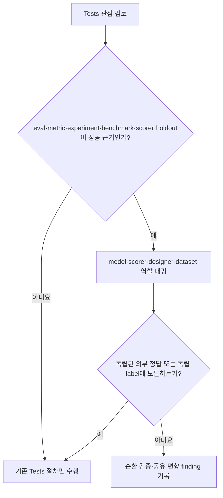

# 스펙: 평가 독립성 리뷰 계약

- 날짜: 2026-08-26 / 상태: 구현됨
- 관련: ADR 051, `docs/proposals/2026-08-26-paperthin-review.md`

## 배경

현재 `team-review`의 Tests 관점은 스펙 완료 기준별 테스트 존재와 실패 경로를 확인하지만, 그 테스트가 의존하는 평가 기준 자체가 독립적인지는 묻지 않는다. 기준선 압박 사례에서 동일 모델이 과거 출력으로 rubric과 category boundary를 만들고 별도 호출에서 그 rubric으로 채점했으며, holdout도 같은 큐레이션 팀과 recipe를 공유했다. 현행 reviewer는 일반 증거 형식 누락 때문에 전체를 `BLOCK`했지만 이 순환성은 명시적으로 차단 사유가 아니라고 판정했다.

Paperthin의 `mandela`가 열거한 검증 실패 유형 중 이 공백을 직접 메우는 개념만 가져온다. 외부 스킬이나 hook을 설치하지 않고 기존 Tests 관점의 조건부 절차로 둔다.

## 목표

- 평가·지표·실험·벤치마크가 성공 근거인 변경에서 독립된 외부 ground truth가 있는지 검토한다.
- model·scorer·designer·dataset 역할을 드러내 순환 검증과 공유 편향을 찾는다.
- 기존 reviewer 호출 수와 라우팅을 늘리지 않는다.

## 비목표

- 새 스킬·agent·perspective·hook·외부 런타임을 만들지 않는다.
- 모든 코드 리뷰에 평가 독립성 절차를 강제하지 않는다.
- domain-specific 통계 기법이나 특정 benchmark를 표준화하지 않는다.
- 저자의 테스트 결과를 reviewer가 다시 실행하는 기존 실행 증거 독립성을 대체하지 않는다.

## 요구사항

- **R1**. `team-review`의 Tests 관점은 대상이 eval·metric·experiment·benchmark·scorer·holdout을 성공 근거로 사용할 때만 평가 독립성 점검을 발동한다.
- **R2**. 발동 시 reviewer는 model·scorer·designer·dataset의 역할을 매핑하고, 성공 판정이 독립된 외부 ground truth 또는 독립 label에 닿는지 확인한다.
- **R3**. 최소한 다음 실패를 찾는다: scorer가 자신이 만든 rubric/category를 채점, 검증자와 설계자가 같은 비공개 recipe 공유, train/holdout이 같은 labeler pool·curation recipe를 공유하면서 독립 확인 없음, hypothesis나 기대 답이 validator prompt/data에 새어 듦.
- **R4**. 이 절차는 기존 Tests 관점의 한 조건부 항목이며 새 perspective·reviewer·fan-out을 만들지 않는다.
- **R5**. 기존 실행 증거 규율과의 경계를 명시한다. 재실행·author/verifier 분리는 실행 결과의 독립성을, 이 요구사항은 성공 기준 자체의 독립성을 다룬다.
- **R6**. 영어 원본과 한국어 열람 뷰, 외부 도구 제안서, ADR, MOC, 변경 이력을 같은 변경에서 동기화한다.
- **R7**. 지속 회귀 테스트가 발동 조건, 역할 매핑, 대표 순환성, 무호출 증가 경계를 검사한다.

## 인터페이스 / 설계 개요

reviewer가 이미 선택한 Tests 관점 안에서 대상이 평가 설계를 포함하는지 확인한 뒤, 포함할 때 네 역할과 ground truth 경계를 추적한다. 일반 테스트 리뷰에는 추가 절차가 없다.

같은 축처럼 보이는 기존 규칙은 두 가지다. `team-review` Solo의 테스트 재실행과 root §13-2의 독립 확인은 **관찰된 실행 결과**를 믿을 수 있는지 다룬다. infra의 author/verifier independence는 **산출물 저자**와 검토자를 분리한다. 새 계약은 둘을 바꾸지 않고, 평가가 말하는 성공 기준이 평가 설계자에게 되돌아오는 폐회로인지에만 발동한다.

## 완료 기준 (테스트 가능한 형태)

- [x] **C1 (R7)**: 계약 테스트를 변경 전 `team-review`에 실행하면 5건이 실패하고 변경 후 실행하면 5건이 통과한다.
- [x] **C2 (R1)**: `team-review` Tests 행과 바로 이어진 정본 문단을 읽으면 여섯 대상 유형과 성공 근거일 때만 발동하는 조건을 확인할 수 있다.
- [x] **C3 (R2)**: 정본 문단을 읽으면 model·scorer·designer·dataset 네 역할과 independent external ground truth를 확인할 수 있다.
- [x] **C4 (R3)**: 정본 문단을 읽으면 rubric/category 자가 채점, private recipe 공유, labeler pool·curation recipe 공유, hypothesis의 validator prompt/data 누출 네 실패 유형을 모두 확인할 수 있다.
- [x] **C5 (R4, R5)**: 정본 문단을 읽으면 새 perspective·reviewer·fan-out을 만들지 않고 실행 증거 독립성과 성공 기준 독립성을 구분한다.
- [x] **C6 (R1, R2, R3)**: 기준선 사례를 새 계약으로 다시 검토하면 rubric/scorer 폐회로와 공유 curation recipe 편향이 verdict 근거에 포함된다.
- [x] **C7 (R7)**: `python3 .agents/hooks/eval-independence-contract_test.py`, `python3 .agents/hooks/token-efficiency-contract_test.py`, `python3 .agents/hooks/integrity-check.py`, `git diff --check`를 실행하면 모두 exit 0이 된다.
- [x] **C8 (R6)**: 영어 원본·한국어 뷰·제안서·ADR·MOC·변경 이력의 8개 경로를 독립 검토하면 must-fix가 0건이 된다.

## 미해결 질문

없음

## 변경 이력

| 날짜 | 변경 내용 | 대상 | 사유 |
|---|---|---|---|
| 2026-08-26 | 평가 독립성 리뷰 계약 확정 | `team-review`, 한국어 열람 뷰, 계약 테스트 | Paperthin `mandela` 부분 채택과 기준선 압박 결과 |
| 2026-08-26 | 구현·독립 검증 완료 | C1~C8, Tests 관점, 계약 테스트 | 3관점 최종 PASS와 integrator C8 PASS |
