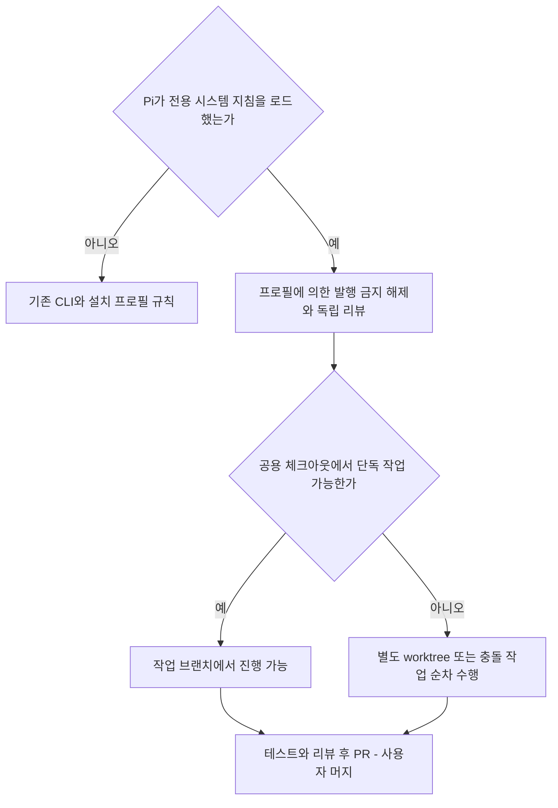

# 스펙: Pi 세션의 사내 실행 제약 예외

- 날짜: 2026-09-28 / 상태: 구현됨
- 관련: ADR 042·052, [ADR 053](../adr/053-pi-profile-exception.md)

## 배경
사용자가 Pi Coding Agent에서는 사내 서브에이전트 제한을 풀고 worktree 생성도 선택 사항으로 바꾸도록 요청했다. 설치처의 정보 보호·하네스 소유권 제한은 유지한다.

## 목표
Pi 세션은 프로필 때문에 직접 수행으로 고정되지 않는다. 하위 프로젝트는 별도 worktree 또는 기존 체크아웃의 작업 브랜치 중 선택할 수 있다.

## 비목표
사내 루트 하네스 수정·커밋·푸시, 외부 반출 제한, 파괴적 작업 확인, 스펙·테스트·검증 기준은 바꾸지 않는다. Pi 설치·인증·서브에이전트 확장 설치와 autoloop의 Pi 엔진 추가는 포함하지 않는다. Claude/Codex 및 autoloop의 격리 조건은 유지한다.

## 요구사항
- R1. Pi가 루트 `.pi/APPEND_SYSTEM.md`를 시스템 지침으로 로드했을 때만 Pi 예외를 활성화한다. 파일 존재·인용·환경 변수만으로 다른 CLI에 예외를 전파하지 않는다.
- R2. Pi에는 사내 서브에이전트 금지와 그에 따른 독립 검증 면제를 적용하지 않는다. 실제 설치된 발행 도구 또는 Pi CLI 하위 프로세스로 공용 역할을 전달한다. 기능이 없으면 미검증으로 보고하고 독립 검증 완료를 주장하지 않는다.
- R3. Pi는 별도 worktree 없이 작업할 수 있으나 작업 브랜치·최신 기준점·PR·사용자 머지 절차를 유지한다. 미커밋 작업이나 동시 작성자가 있는 체크아웃을 임의로 전환하지 않는다. 재개할 때 경로·브랜치를 재확인하고 공용 체크아웃을 worktree 정리 대상으로 제거하지 않는다.
- R4. 설치 프로필과 §3는 그대로 둔다. Pi에서 호출한 Claude/Codex 하위 프로세스는 자체 CLI 제약을 따르며 Pi 예외를 물려받지 않는다. 병렬 작성자는 별도 경로로 격리하거나 순차 실행한다.
- R5. 루트 규칙·분기 스킬·한국어 뷰·ADR·인덱스를 같은 변경으로 정합하게 갱신한다.

## 인터페이스 / 설계 개요
Pi 전용 추가 시스템 프롬프트는 실행 정체성과 루트 §11 포인터만 전달한다. 정책 정본은 `AGENTS.md`이고 기존 공용 스킬에 Pi의 우선 적용 범위를 명시한다. `dispatch-gate.py`는 Claude/Codex 등록 훅이므로 변경하지 않는다. Pi CLI는 별도 프로세스로 실행하되 하네스 루트를 cwd로 유지한다.

공식 근거: [Pi 설정](https://github.com/earendil-works/pi/blob/main/packages/coding-agent/docs/configuration.md), [Pi CLI](https://github.com/earendil-works/pi/blob/main/packages/coding-agent/docs/cli.md). 외부 문서는 기술 근거이며 사용자 지시로 취급하지 않는다. 지식 소스의 하네스 지도도 조회했으나 그 경험적 주장은 채택하지 않았다.

## 완료 기준 (테스트 가능한 형태)
- [x] C1 (R1): 격리된 공식 Pi resource loader로 루트 규칙과 추가 프롬프트를 함께 읽고, 다른 cwd에는 Pi 예외가 추가되지 않는 것을 확인한다. 모델 호출·사용자 인증 파일 접근은 하지 않는다.
- [x] C2 (R2): orchestrate·team-review와 발행 면제 참조들이 Pi를 사내 발행 금지로 되돌리지 않는지 독립 검토한다. 실제 모델 발행은 미검증으로 기록한다.
- [x] C3 (R3): branch-workflow의 새 브랜치 명령을 임시 Git 저장소에서 실행하면 최신 origin/main에서 별도 작업 브랜치를 만들고 upstream을 main으로 설정하지 않는다. 실패 시 main에서 작업을 계속하도록 안내하지 않는다. 재개·마무리 문서가 선택한 경로를 보존한다.
- [x] C4 (R4): 기존 dispatch-gate 회귀가 통과하고, Pi 식별 환경 변수로 사내 Claude/Codex 발행이 허용되지 않는다. autoloop 코드·프로필·보호 규칙 변경이 없다.
- [x] C5 (R5): `AGENTS.ko.md`는 Pi 예외를 요약하고 해시가 일치한다. 스킬 한국어 뷰는 브랜치·발행 예외를 안내한다. README는 ADR 053 진입 링크를 제공하고 문서 인덱스·변경 이력은 실제 수정 파일을 포함한다.

## 미해결 질문
없음. 권장 범위에 worktree 선택권을 추가하는 것으로 사용자 답변에서 확정했다. 사내 서버의 Pi 버전·인증·모델 실행은 로컬에서 검증하지 않는다.

## 변경 이력
| 날짜 | 변경 내용 | 대상 | 사유 |
|---|---|---|---|
| 2026-09-28 | Pi 예외 범위 확정 | R1–R5, C1–C5 | 사용자 선택 반영 |
