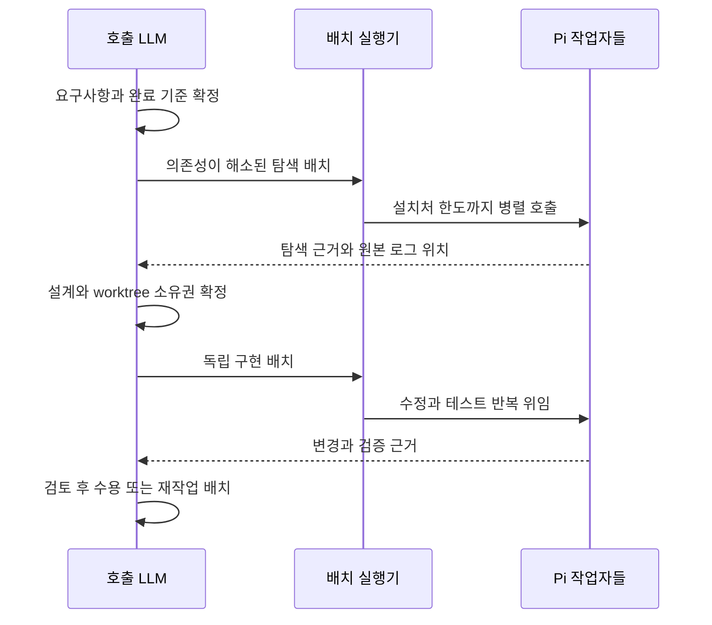

# 스펙: 사내 Pi 병렬 작업자

- 날짜: 2026-10-05 / 상태: 구현됨
- 관련: [ADR 053](../adr/053-pi-profile-exception.md)

## 배경
사용자는 사내에서 호출 LLM이 설계와 조율을 맡고, 비용을 고려할 필요가 없는 사내 모델에 Pi를 통해 탐색·구현을 최대한 병렬 위임하도록 요청했다. 기존 사내 정책은 호출 LLM이 모든 작업을 순차로 수행하게 하므로 이 경로가 없다.

## 목표
사내 Claude/Codex 호출 LLM의 직접 작업을 Pi 작업자에게 위임하고, 독립 작업을 설치처 동시 실행 한도까지 병렬 실행한다. 개인 프로필의 기존 실행 선택은 유지한다.

## 비목표
사내 엔드포인트·인증 설정, 모델 성능 평가, 호출 LLM 자체 서브에이전트 차단의 전면 해제, Pi 기본 세션의 기존 정책 변경, autoloop 엔진 변경은 범위 밖이다. 사내 서버 실연결과 최적 동시 실행 수 측정은 배포처에서 확인한다.

## 요구사항
1. R1: 새 경로는 REGISTRY.md의 설치처 프로필이 사내일 때만 실행된다. 개인·미상에서는 작업자를 시작하지 않는다.
2. R2: 호출 LLM은 요구사항·설계·작업 의존성·최종 판단을 소유한다. Pi 작업자 역할은 explorer와 implementer로 한정한다. infra-specialist의 기존 의무는 유지한다.
3. R3: 사내 provider와 정확한 model ID, 최대 동시 호출 수를 미추적 설치 설정으로 받는다. 유료 모델로의 자동 대체나 모델명 추측은 하지 않는다. 내부 모델 비용 때문에 작업자 수를 줄이지 않는다.
4. R4: 호스트가 의존성이 해소된 독립 작업 배치를 만든다. 실행기는 설치처 한도 내에서 병렬 실행한다. 코드 작성 작업은 별도 feature worktree를 사용하고, 배치 내 대상 경로가 겹치면 시작 전에 거부한다.
5. R5: 루트에서 Pi를 실행하고 Pi 시스템 지침·공용 역할·작업 범위를 전달한다. 작업자는 재위임·commit/push·승인이 필요한 조작을 수행하지 않는다. 도구 선택은 explorer 읽기 전용, implementer 수정·테스트용으로 구분하며 OS 샌드박스로 오인하지 않는다.
6. R6: 실행기는 원본 stdout/stderr·최종 응답을 작업별 보존한다. 정상 프로세스 종료만으로 성공을 판정하지 않고 JSON 이벤트의 최종 assistant 종료 사유를 확인한다. 시간 초과는 자식 프로세스 그룹을 종료하고 실패로 회수한다. 정상 응답도 검토 전 후보일 뿐 완료가 아니다.
7. R7: 호출 LLM의 native dispatch 차단은 유지하되 차단 안내는 Pi 위임 경로를 가리킨다. 사내 비-Pi 호스트의 검토는 호출 LLM이 하며 별도 reviewer 세션을 실행했다고 기록하지 않는다. 개인·Pi 자체 세션의 독립 검증 규칙은 유지한다.
8. R8: 루트 수정·외부 반출·SDD/TDD·missing-harness 정지·자동 일일 리뷰 정책은 유지한다. 가용성 실패를 숨기거나 유료 실행으로 대체하지 않는다.

## 인터페이스 / 설계 개요
`orchestrate/references/corporate-pi.md`가 호스트 절차와 설치 설정을 정의한다. `orchestrate/scripts/pi_workers.py`는 `--root`, `--config`, `--batch`, `--output`을 받아 독립 작업 배치를 실행한다. `_workspace/`의 설정에는 provider/model/max_parallel을 두며 인증은 기존 Pi 설치에서 관리한다. 실행기는 프로세스 조율만 하며 작업 분할·의존성 해소·검증 판단은 호출 LLM이 수행한다.

## 완료 기준 (테스트 가능한 형태)
- [x] C1 (R1, R3): 사내만 실행되고 설정 누락·개인·미상에서는 자식 호출이 없다.
- [x] C2 (R2, R4, R5): 허용 역할·분리된 작업 경로·feature worktree 조건을 검사하고 읽기 역할과 수정 역할에 다른 도구를 전달한다.
- [x] C3 (R3, R4): 가짜 Pi 프로세스의 실행 구간이 겹치며 설정한 동시 실행 한도를 넘지 않는다.
- [x] C4 (R6): 정상 응답·모델 오류·프로세스 오류·잘린 응답·시간 초과를 구별하고 작업별 결과와 로그를 보존한다.
- [x] C5 (R7, R8): 기존 dispatch 회귀가 통과하고 새 차단 메시지가 Pi 경로를 안내한다. 연결·권한·검증의 미확인 범위를 최종 보고에 적는다.
- [x] C6: AGENTS·CLAUDE·관련 스킬·한국어 뷰·ADR·색인이 사내 경로와 기존 Pi 예외를 구분하고 독립 리뷰가 통과한다.

## 미해결 질문
없음. 실제 사내 provider/model ID와 동시 실행 한도는 배포처 설정이며 이 개인 설치처에서 추측하지 않는다.

## 변경 이력
| 날짜 | 변경 내용 | 대상 | 사유 |
|---|---|---|---|
| 2026-10-05 | 사내 전용 병렬 작업 경로 확정 | 본문 | 사용자 실행 정책 변경 |
