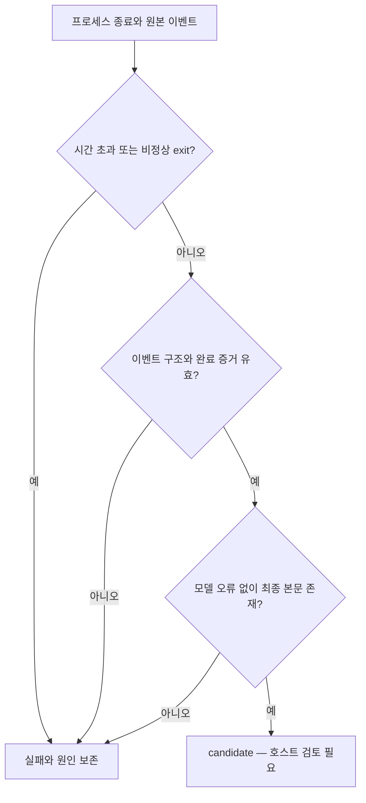

# 스펙: Pi 작업자 CLI 호환성과 응답 판정

> 폐기: 2026-10-07 [ADR 055](../adr/055-retire-corporate-pi-workers.md)에 따라 이 경로의 실행·후속 작업을 중단했다. 아래 스펙과 검증 기록은 당시 이력이며 현재 실행 지침이 아니다. CLI-JSONL 후속도 이 하네스 범위에서는 종료한다.

- 날짜: 2026-10-06 / 상태: 폐기 — ADR 055 (당시 구현·검증 기록은 아래 보존)
- 관련: [기존 작업자 스펙](2026-10-05-corporate-pi-workers.md), [ADR 054](../adr/054-corporate-pi-workers.md)

## 배경
사용자가 설치처 0.7.0 CLI에서 `--provider`와 `--list-models`가 지원되지 않으며, 단발 실행은 `-p <프롬프트>`, 시스템 파일은 `--append-system-prompt @파일`로 전달한다고 보고했다. 실제 호출은 `session → turn_start → turn_end`로 끝났다. 기존 실행기는 다른 Pi CLI의 옵션과 `message_end → agent_end` 형식을 일괄 적용했다. 후속 실측에서는 `-p`를 값 없는 옵션으로 전달해 `expected one argument`가 발생했으므로 프롬프트 위치도 CLI별로 구분한다.

## 목표
기존 Pi 설정을 유지하면서 설치처 CLI를 명시적으로 선택하고, 오류·빈 응답·미완료 응답을 검토 가능한 정상 후보와 구분한다. 사내에서 기존 인증 설정을 그대로 사용해 작업자 설정 생성부터 실제 읽기 전용 위임까지 확인할 절차를 제공한다.

## 비목표
인증정보 생성·복사, 내부 모델·주소 추측, 개인 프로필의 실제 사내 모델 호출, 자동 CLI 대체, 기존 위임 권한·worktree·동시 실행 정책 변경은 하지 않는다. 실제 사내 실행과 설치처 전용 도구·이벤트 필드 확인은 설치처 근거가 필요하다.

## 요구사항
1. R1: 설정 `cli` 생략 또는 `pi`는 기존 provider/model 필수와 마지막 `-- <프롬프트>` 호출 형식을 유지한다. `ax`는 `--provider`를 전달하지 않으며 `-p <프롬프트>`와 `@` 시스템 파일 참조를 사용한다. AX의 `-p/--prompt`는 값을 받는 옵션으로 프롬프트 전체를 바로 다음 단일 인자로 전달하고 마지막 `-- <프롬프트>`는 붙이지 않는다. 알 수 없는 종류는 시작 전에 거부한다.
2. R2: `ax`의 정확한 도구 이름은 설치된 CLI 도움말·소스로 확인한 역할별 목록을 설치 설정에서 받는다. 기존 Pi 도구 이름을 추측해 대입하지 않는다. 모델을 생략하면 CLI의 기존 설정을 사용한다. 인증은 CLI가 기존 설정에서 읽고, 실행기는 인증 필드·환경변수·로그인 절차를 생성하지 않는다.
3. R3: 정상 프로세스 종료와 CLI별 완료 이벤트, 최종 assistant의 공백이 아닌 본문을 만족해야 `candidate`가 된다. upstream Pi와 배열 응답은 `stopReason=stop`이 필요하다. AX 문자열 응답은 `stopReason` 필드가 없어도 허용하되 명시적인 오류·중단·잘림 표시가 없어야 한다. 종료 이벤트만으로 성공하지 않는다. 새 turn이 시작되면 이전 응답을 재사용하지 않는다.
4. R4: 결과에 기계 판독 가능한 실패 구분을 남긴다. 모델 오류, 잘림, 중단, 빈 응답, 완료 누락, 잘못된 JSON/구조, 프로세스 실패, 시간 초과를 구분한다. 오류 이벤트 뒤의 정상처럼 보이는 메시지가 오류를 지우지 않는다.
5. R5: 사용자 요청에 따라 여기서 설치처 CLI 직접 확인은 생략한다. 사용자가 제공한 실측 AX 응답은 `turn_end.message`의 `role=assistant`, 문자열 `content`이며 `stopReason`은 없다. 대응하는 `turn_start` 이후 이 형식을 지원하고 기존 배열/text 블록 형식도 유지한다. 제공된 실측 JSON의 로컬 재생과 합성 실패 fixture를 사내 실호출로 표현하지 않는다. 알 수 없는 envelope와 명시된 알 수 없는 종료 사유는 정상 후보로 수용하지 않는다.
6. R6: 런북에 CLI 계약 확인, 미추적 설정 생성, 읽기 전용 smoke 배치, 원본 이벤트·결과 판정, 실패 시 재시도 조건을 적는다. 설치처별 값은 공개 문서에 적지 않는다.

## 인터페이스 / 설계 개요
기존 `--root`, `--config`, `--batch`, `--output` 인터페이스를 유지한다. 설정의 `cli`로 인자 생성과 종료 이벤트 해석을 선택한다. `ax`의 `tools`는 explorer·implementer별 정확한 CLI 이름 목록이다. 기존 `status`는 유지하고 `failure_kind`로 실패 이유를 분류한다. 원본 이벤트는 외부 프로세스 데이터로 취급한다.

## 완료 기준 (테스트 가능한 형태)
- [x] C1 (R1, R2): 기존 설정 회귀가 통과하고 ax 인자에 provider가 없으며 `-p <프롬프트>`, `@파일`, 설정한 역할별 도구 이름이 전달된다.
- [x] C2 (R3, R4): 정상·오류·빈 응답·새 turn의 응답 누락·잘림·손상 JSON·비정상 exit·시간 초과가 각각 예상 판정으로 끝난다.
- [x] C3 (R5): 지원 계약의 `session → turn_start → turn_end`에서 성공·오류·빈 응답 회귀가 통과하고 알 수 없는 payload는 실패한다. 사용자 제공 실측 JSON의 로컬 재생과 합성 실패 fixture를 구분하고 테스트가 사내 실호출이 아님을 명시한다.
- [x] C4 (R6): `docs/runbooks/pi-worker-cli-setup.md`가 설정 생성과 읽기 전용 실제 위임 명령, 결과 기대값과 실패 대응을 제공한다. `corporate-pi.md`는 CLI별 계약과 런북 링크를 안내한다.
- [x] C5 (R1–R6): 기존 프로필·worktree·병렬 실행 회귀와 무결성 검사를 통과하고 독립 검토를 받는다. 사내 실호출 여부를 별도로 보고한다.
- [x] C6 (R1): AX의 값 필수 `-p/--prompt` 파서가 기존 잘못된 호출을 `expected one argument`로 거부하고 수정한 호출은 통과한다. 공백·개행·따옴표·한국어를 포함한 프롬프트가 그대로 전달되며 AX의 후행 위치 인자는 거부한다. upstream은 기존 위치 인자 형식을 유지한다.
- [x] C7 (R3–R5): 제공된 AX 실측 문자열 JSON은 정상 후보가 되고, 빈 문자열·공백·오류 이벤트 전후 응답·미완료·잘못된 역할·명시적인 오류/중단/잘림·정상 출력 뒤 비정상 exit는 실패한다. 문자열 예외는 upstream과 배열 응답의 기존 종료 사유 검사를 완화하지 않는다.

## 미해결 질문
없음. 사용자에게 확인한 결과 CLI는 사내에만 있으며 여기서 직접 확인은 생략하도록 지시했다. 따라서 도구 이름은 설치처 설정으로 분리하고 지원 JSON 계약과 합성 테스트 범위를 명시한다. 실제 CLI와의 일치는 사내 smoke 절차로 확인할 항목이며 이 작업의 실측 주장에 포함하지 않는다.

## 변경 이력
| 날짜 | 변경 내용 | 대상 | 사유 |
|---|---|---|---|
| 2026-10-06 | AX 실측 문자열 content와 stopReason 생략 지원 기준 정의 | R3·R5·C7 | 사용자 제공 정상 JSON을 배열 전용 파서가 invalid_stream으로 처리한 오류 수정 |
| 2026-10-06 | AX의 값 필수 -p/--prompt 계약과 upstream 후행 위치 인자 유지 조건 명시 | R1·C6 | 사용자 실측 오류: argument -p/--prompt: expected one argument. 기존 fixture는 마지막 인자만 읽어 누락을 검출하지 못함 |
| 2026-10-06 | CLI 분리·명시적 완료 판정·사내 확인 절차 정의 | 본문 | 사용자 보고와 기존 실행기의 옵션·이벤트 계약 불일치 |
