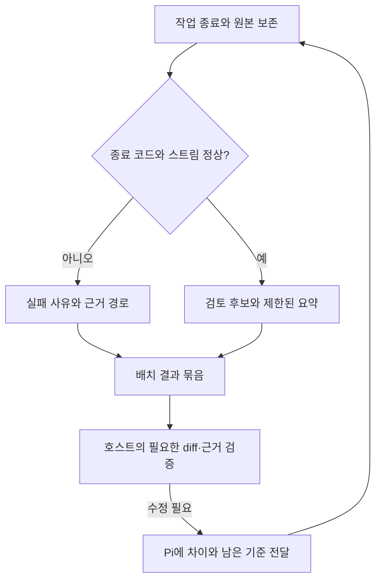

# 스펙: 사내 Pi 작업 경로의 호스트 입력 절감

> 폐기: 2026-10-07 [ADR 055](../adr/055-retire-corporate-pi-workers.md)에 따라 이 경로의 실행·후속 작업을 중단했다. 아래 스펙과 검증 기록은 당시 이력이며 현재 실행 지침이 아니다. CLI-JSONL 후속도 이 하네스 범위에서는 종료한다.

- 날짜: 2026-10-06 / 상태: 폐기 — ADR 055 (당시 구현·검증 기록은 아래 보존)
- 관련: [기존 경로](2026-10-05-corporate-pi-workers.md), [CLI 호환성](2026-10-06-pi-worker-cli-compatibility.md), ADR 054

## 배경

현재 실행기는 AX 이벤트 전반의 `truncated`를 실패로 판정한다. 도구의 부분 출력과 최종 응답의 중단을 구별하지 못한다. 배치를 기다리는 기능은 이미 있지만 반환값은 건수와 경로뿐이라 호스트가 결과 파일을 다시 읽어야 한다. 사용자가 보고한 완료 기록 11건 중 거부 5건은 이 개인 설치처에서 원본을 확보하지 못했으므로 로컬 재현과 구분한다.

## 목표

정상 도구 부분 출력을 수용하면서 손상·미완료 결과를 거부한다. 호스트는 한 번에 받은 제한된 요약에서 필요한 근거만 골라 읽는다. 구현·테스트·수정은 하나의 작업자 할당 안에서 완결한다.

## 비목표

사내 모델 호출 실측, 공통 병렬 수 설정, 자동 재시도·머지, 호스트 최종 리뷰의 제거, 임의 스트림 형식의 추측 지원은 하지 않는다. 실제 토큰 사용량이 없으므로 토큰 절감률을 추정하지 않는다.

## 요구사항

1. R1: 지시문은 목표·소유 경로와 읽을 범위·인터페이스·완료 기준·검증 명령을 담는다. 전체 소스를 반복 복사하지 않는다.
2. R2: 작업자는 기존 재시도 한도 안에서 구현·테스트·수정을 수행하고 요약·변경 파일·명령과 결과·미해결 사항·원본 근거 경로를 반환한다. 원본 stdout/stderr와 보고서는 보존한다.
3. R3: 알려진 도구 출력 이벤트와 toolResult 메시지의 출력 잘림은 최종 응답 잘림과 구분한다. 오류·취소 표시는 유지한다. JSON/UTF-8 손상, 잘못된 메시지 형식, 완료 없는 응답은 성공으로 승격하지 않는다. invalid_stream에 줄 번호와 판정 사유를 남긴다.
4. R4: 종료 시 candidate·실패·판단 필요를 하나의 제한된 묶음으로 반환한다. 긴 보고서는 명시적 발췌 표시와 전체 경로를 제공한다. 실행 중 원본 로그를 호스트에 흘리지 않는다. 대기 중 사용자 안내와 SIGINT 취소, 대기열 작업 기록을 유지한다.
5. R5: 설치별 max_parallel·의존성·worktree 격리·반출 및 승인 경계는 유지한다. 호스트는 요약 후 diff와 새 테스트 근거를 직접 검증한다.
6. R6: 같은 합성 작업의 기존 건수 반환+파일 재읽기와 새 묶음 반환을 비교한다. 호스트에 결과를 전달하는 왕복 횟수와 UTF-8 바이트를 측정하며 실제 모델 호출·토큰과 구분한다.

## 인터페이스 / 설계 개요

기존 CLI·배치 입력을 유지한다. `results.json`과 개별 원본은 그대로 두고 `summary.json` 및 동일 내용의 stdout 한 줄을 추가한다. 항목마다 상태·실패 종류·판정 상세·보고서 발췌·원본 경로를 제공한다. 선택적인 JSON 보고서의 `summary`, `changed_files`, `tests`, `unresolved`, `evidence`, `decision_needed`를 지원하되 기존 문자열 보고서도 candidate 계약을 유지한다. 계약이 불완전하면 전체 보고서 확인이 필요하다고 표시한다. 이 표시는 테스트나 호스트 리뷰의 통과를 뜻하지 않는다.

## 완료 기준 (테스트 가능한 형태)

- [x] C1 (R1–R2): corporate-pi에 지시문·보고서 계약과 테스트/수정 소유권을 적고, 주입 역할과 충돌하지 않는다.
- [x] C2 (R3): 정상 도구 부분 출력은 후보, 최종 응답 잘림·손상 JSON/UTF-8·잘못된 메시지·미완료는 실패로 재현된다. 기존 AX 문자열 사례를 유지한다.
- [x] C3 (R4–R5): 비정상 종료·시간 초과·취소·긴 로그·동시 완료·대기열 취소와 기존 격리/용량 테스트가 통과한다.
- [x] C4 (R6): 동일 작업의 재현 가능한 비교 스크립트·원본 측정값을 남긴다. 실제 모델 호출 횟수는 미측정임을 표시한다.
- [x] C5 (R1–R6): 루트 규칙과 한국어 뷰는 간결한 경로 계약, corporate-pi는 상세 절차, 스펙은 판정·측정 기준, 변경 이력은 근거와 한계를 기록한다. 독립 리뷰 후 커밋·푸시한다.

비교 명령은 `python3 .agents/skills/orchestrate/scripts/pi_workers_benchmark.py --output <새 경로>`다. 기준 커밋 `9f2e012cba23da17fadd379647fe9ef638074b4b`과 현재 실행기에 동일한 읽기 작업 3개를 준다. 2026-10-06 로컬 실행에서 최초 결과 전달은 3회·2,179바이트에서 1회·1,651바이트로 바뀌었다. 양쪽 모두 원본 로그를 호스트 입력에서 제외하고, 동일한 구조화 보고서 전체를 전달했다. 이는 결정론적 호스트 드라이버의 도구 응답 수와 UTF-8 바이트이며 실제 호스트 LLM 호출 수나 토큰 사용량이 아니다. 진행 중 폴링과 최종 diff/테스트 리뷰는 측정하지 않았다. 원본 출력은 각각 603,550바이트였으며 원본 보존을 확인했다. 경로 길이·시각에 따라 바이트 수는 달라질 수 있다.

독립 검증은 실행 정확성·테스트/측정·규칙/문서 관점에서 모두 PASS였다. `pi_workers_test.py` 44개, 프로필 계약 4개, 위임 게이트 14개가 통과했고 정합성 검사는 55 pass였다. 별도 독립 실행으로 의존성 사전 거부와 TERM을 무시하는 자식 프로세스 정리도 확인했다. 이는 사내 서비스 연결 검증을 대체하지 않는다.

## 미해결 질문

없음. 사내 원본 11건과 실서비스 검증은 이 설치처에서 미확인이다. 지식 소스 진입점은 읽기 시간 초과였으며 외부 지식에 의존한 설계 주장은 없다.

## 변경 이력

| 날짜 | 변경 내용 | 대상 | 사유 |
|---|---|---|---|
| 2026-10-06 | 판정 경계와 요약 반환·측정 기준 확정 | 실행기, corporate-pi 계약 | 도구 잘림의 과도한 실패 판정과 결과 재읽기 비용을 로컬에서 검증 |
