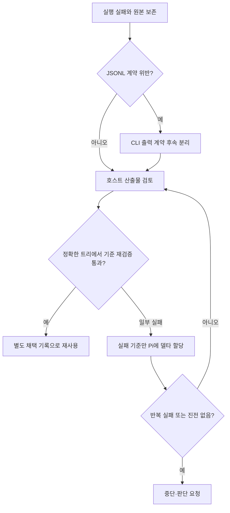

# 스펙: 보고된 Pi 출력 실패와 산출물 재사용

> 폐기: 2026-10-07 [ADR 055](../adr/055-retire-corporate-pi-workers.md)에 따라 이 경로의 실행·후속 작업을 중단했다. 아래 스펙과 검증 기록은 당시 이력이며 현재 실행 지침이 아니다. CLI-JSONL 후속도 이 하네스 범위에서는 종료한다.

- 날짜: 2026-10-06 / 상태: 폐기 — ADR 055 (당시 구현·검증 기록은 아래 보존)
- 관련: [호스트 입력 절감](2026-10-06-pi-worker-economy.md), ADR 054

## 배경

사용자가 사내 AX Pi CLI 0.7.0에서 관측했다고 전달한 사례는 다음과 같다. 개인 설치처에서는 해당 파일·로그·CLI 구현을 직접 확인하지 않았다.

- `tool_result.truncated=true`가 표시용 잘림인데 작업 실패로 분류됐다.
- JSON 모드 stdout에 재시도·루프 경고 일반 텍스트가 섞여 `invalid_stream`이 발생했다.
- 실패한 실행에도 코드가 남았으며 호스트의 검토·테스트 재실행으로 유효성을 확인했다.
- 확인된 소스의 반복 탐색, 작은 작업의 분할과 재시도가 지연을 키웠다.

로컬에서 확인한 사실은 현재 파서가 `tool_result`를 표시용 잘림 예외로 포함하지 않는다는 점이다. 아래 테스트는 전달된 의미를 모델링한 **합성 이벤트**이며 실제 AX 로그 사본이나 정확한 전체 스키마 검증이 아니다.

## 목표

도구 표시 잘림과 응답 손실을 구별한다. 스트림 실패와 산출물의 검토 결과를 별도로 보존한다. 확인한 정보를 재사용하고 실패한 범위만 수정한다.

## 비목표

사내 CLI 수정·실서비스 검증, 임의 텍스트 제거·JSON 추출 복구, 실패 상태의 자동 성공 전환, 자동 산출물 채택, 병렬 용량 기본값 변경, 모델 진행 상태의 자동 판정은 하지 않는다.

## 요구사항

1. R1: AX `type=tool_result`의 표시용 잘림을 예외로 처리하되 오류·취소·최종 응답 잘림·완료 부재·비정상 종료는 계속 실패한다. 명시적 `stopReason=length`는 도구 메타데이터만으로 지우지 않는다. 완료 후 새 도구 결과는 이전 최종 응답을 재사용하지 못한다.
2. R2: stdout은 이벤트 JSONL 계약을 유지한다. 일반 텍스트가 앞·중간·뒤에 섞여도 `invalid_stream`과 줄 번호를 남기고 원본 바이트를 보존한다. stderr의 일반 경고는 stdout 계약 위반으로 취급하지 않는다. CLI 후속은 구현 재시도와 분리한다.
3. R3: 할당은 목표·소유 파일·확인된 소스/심볼/범위와 확인 시점의 리비전 및 작업 트리 상태·결정된 인터페이스·완료 기준·검증 명령·남은 질문을 담는다. 파일 변경이나 근거 충돌 없이 이미 끝난 탐색을 재시작하지 않는다. 요약은 근거 경로를 대신하지 않는다.
4. R4: 같은 파일·인터페이스·검증 루프를 공유하는 작은 변경은 하나의 Pi 작업으로 유지한다. 독립 소유권과 독립 완료 기준이 있을 때만 분할한다. 용량을 채우기 위한 분할은 하지 않으며 준비된 독립 작업은 설치별 용량을 활용한다.
5. R5: 실행 실패 후 쓰기를 반복하기 전에 프로세스 종료, 원본 결과 보존, 기존 변경/미추적 파일 구분, 호스트 diff 검토, 정확한 트리의 새 검증을 수행한다. 채택 근거는 별도 호스트 기록으로 남기며 원래 failed/result.json을 고치지 않는다. 통과한 범위는 유지하고 실패한 기준만 같은 격리 작업 디렉터리에서 델타 재시도한다. 출력 디렉터리는 매번 새로 만든다.
6. R6: 같은 원인의 실패가 수정 재시도 후 반복되거나, 동일한 소스/명령 반복에 새 근거·산출물·가설 변경이 없으면 작업자는 중단하고 판단 요청을 반환한다. 새 작업 ID로 기존 재시도 한도를 초기화하지 않는다. 할당 시 다음 확인 가능한 진전과 설치별 timeout을 정한다. 로그가 조용하다는 이유만으로 실패 판정하지 않는다. 호스트는 정체를 확인하면 SIGINT로 중단하고 보존된 상태를 검토한다.

## 인터페이스 / 설계 개요

입력 배치·용량·격리 계약과 결과 스키마를 유지한다. 파서 변경은 알려진 도구 이벤트 분류에 한정한다. 나머지는 corporate-pi 절차와 작업자 주입 지침에 기록한다. 진행 없음의 의미 판정은 작업자·호스트 절차이며 실행기는 기존 deadline/SIGINT만 집행한다.

**별도 후속 과제 CLI-JSONL — 미착수, 사내 CLI 소유자가 수행:** JSON 모드의 재시도·루프 경고 출력 지점을 조사한다. 일반 진단문은 stderr로 보내거나 명시적으로 문서화된 JSON 이벤트로 출력하도록 CLI에서 수정한다. 완료 기준은 해당 경고 경로 재현 시 stdout의 모든 행이 계약 이벤트로 파싱되고, 원래 오류/중단 의미와 종료 코드가 보존되며, 현재 실행기의 정상/실패 회귀가 통과하는 것이다. CLI 코드·정확한 이벤트 스키마·실제 재현 명령은 이 설치처에서 미확인이다. 이 과제를 끝내기 위해 하네스에 텍스트 필터나 자동 재시도를 추가하지 않는다.

## 완료 기준 (테스트 가능한 형태)

- [x] C1 (R1): 합성 tool_result 표시 잘림은 정상 완료 시 후보가 되고, 오류·중단·최종 잘림·미완료·완료 이후 도구 결과·비정상 종료는 실패한다.
- [x] C2 (R2): 앞/중간/뒤 일반 텍스트 혼입은 줄 번호와 `invalid_stream`으로 남고 stdout이 그대로 보존된다. stderr 경고만 있는 정상 실행은 후보다.
- [x] C3 (R3–R6): corporate-pi와 주입 지침이 확인 정보 전달·단일 작업 묶음·부분 재시도·재사용 승인 기록·진전 없음 중단 기준을 담는다. 합성 압력 사례로 루트 위임·SDD/TDD·재시도 한도와 충돌하지 않는지 검토한다.
- [x] C4 (R1–R6): 회귀·정합성·독립 리뷰를 통과하고 한국어 뷰·MOC·이력을 갱신한다. 보고된 사실, 로컬 합성 재현, 미검증 CLI 후속을 구분한다.

로컬 검증: 새 합성 회귀 6개 중 변경 전 4개가 실패했다. 수정 후 `python3 .agents/skills/orchestrate/scripts/pi_workers_test.py` 50개가 통과했고, 독립 테스트 리뷰도 같은 결과를 확인했다. 정합성 검사 55 pass, 프로필 계약 4개·위임 게이트 14개 통과, 다이어그램 사전 검사 통과. 실행·테스트·규칙/문서 독립 리뷰는 모두 PASS였다.

별도 합성 의사결정 비교에서 기존 계약도 작업 묶기·확인 정보 재사용·재시도 한도를 지켰으므로 그 부분에 관측되지 않은 실패나 개선 수치를 붙이지 않았다. 달라진 판단은 실패 실행을 후보로 재생성하지 않고 검증된 산출물을 별도 채택할 수 있다는 점과, 확인된 무진전 반복에 명시적 중단·보고를 적용한다는 점이다. 이는 절차 적용 비교이며 사내 작업자 행동·지연·비용의 효과 실측이 아니다.

## 미해결 질문

현재 하네스 변경에 필요한 질문은 없다. 실제 CLI 경고 위치·원본 스키마·산출물 재사용과 중단 기준의 사내 효과는 후속 현장 검증 대상이다. 연결된 지식 소스는 읽기 시간 초과로 사용하지 못했다.

## 변경 이력

| 날짜 | 변경 내용 | 대상 | 사유 |
|---|---|---|---|
| 2026-10-06 | 보고 사례 기반 판정·재사용·중단 기준 확정 | 실행기, corporate-pi, 테스트 | 직접 확인한 로컬 코드와 전달받은 사내 관측을 분리 |
