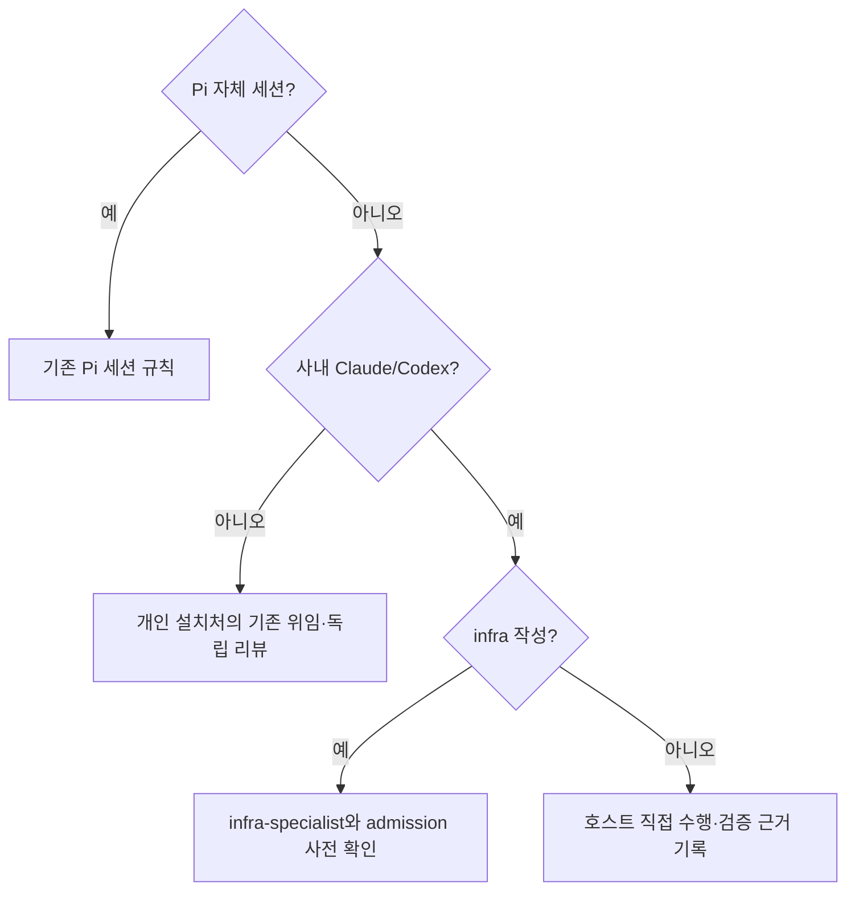

# 스펙: 사내 호스트의 내부 Pi 위임 경로 제거

- 날짜: 2026-10-07 / 상태: 구현·검증 완료
- 관련: ADR 055, [ADR 054](../adr/054-corporate-pi-workers.md)

## 배경

사용자가 사내 내부 Pi 작업자의 품질이 기대에 못 미친다며 해당 경로 제거를 요청했다. 사용자는 이 하네스에서 사내 내부 에이전트를 아예 사용하지 않겠다고 명확히 했다. 이는 사용자 피드백에 따른 실행 정책 변경이며, 개인 설치처에서 사내 품질을 직접 측정한 결과가 아니다.

## 목표

사내 내부 모델·작업자의 선택적 위임·대체 경로도 남기지 않는다. 사내 Claude/Codex 호스트가 Pi 설치·모델·용량에 의존하지 않고 수집·설계·구현·테스트·검토를 직접 수행한다. 기존 사내 네이티브 발행 제한과 안전 규칙은 유지한다.

## 비목표

Pi 자체 세션 지원 제거, 네이티브 서브에이전트 전면 허용, 사내 추적 하네스 수정 허용, 설치 설정·인증·로그 삭제, 사내 자동 배포, 모델 품질·비용의 정량 비교는 하지 않는다.

## 요구사항

1. R1: 루트 지침·Claude 앵커·역할·스킬·문서 생성 템플릿에서 사내 Pi 의무 위임과 호스트 직접 수행 금지를 제거한다. 현황 수집·하네스 리뷰는 호스트가 순차 수행하고 독립 리뷰 부재와 실제 검증 근거를 기록한다.
2. R2: `dispatch-gate`의 사내 차단 판정과 infra 작성 예외는 유지한다. 차단 안내는 호스트 직접 수행과 검증 기록으로 연결하며 Pi 설치를 요구하지 않는다.
3. R3: 사내 전용 실행기·전용 테스트·비교 스크립트를 제거한다. 기존 절차·런북은 실행 명령 없는 폐기 안내로 바꾸고 ADR·선행 스펙·후속 CLI-JSONL 과제를 폐기 표시한다. Git 이력은 보존한다.
4. R4: Pi 자체 세션, 개인 설치처 발행·독립 리뷰, worktree·SDD/TDD·안전·반출·사내 루트 수정 제한은 유지한다. REGISTRY·설치 설정·원본 로그는 건드리지 않는다.

## 인터페이스 / 설계 개요

설정이나 새 실행기를 추가하지 않는다. 기존 사내 직접 수행 경로를 복원한다. 현재 작업은 개인 설치처에서 독립 리뷰 후 `main`에 커밋·푸시한다.

## 완료 기준 (테스트 가능한 형태)

- [x] C1 (R1–R2): 사내 reviewer 발행은 차단되지만 안내가 호스트 직접 수행을 가리킨다. 새 계약 회귀는 활성 지침에 Pi 실행기 경로가 남으면 실패한다.
- [x] C2 (R3): 전용 실행기·테스트·비교 파일이 없고 폐기 안내에는 실행 명령이 없다. ADR·스펙·MOC가 새 결정을 가리킨다.
- [x] C3 (R4): 기존 dispatch·Pi 자체 세션 계약·정합성 검사가 통과하며 설치 파일 보존 해시가 일치한다.
- [x] C4 (R1–R4): 한국어 뷰의 개별 스킬 경계와 혼합 실행 표까지 계약 검사에 포함하고, 한국어 뷰·변경 이력을 갱신하고 활성/역사/독립 Pi 용례를 구분한 잔여 검색과 독립 리뷰를 완료한다.

## 검증 결과

- 변경 전: 새 계약 검사 4개 중 잔여 경로 관련 실패와 기존 차단 안내 검사 실패를 기록했다. 독립 리뷰가 찾은 번역·실행 표 잔여 3곳도 계약을 먼저 확장해 실패를 재현한 뒤 수정했다.
- 변경 후: `python3 .agents/hooks/corporate-host-contract_test.py` 4개, `python3 .agents/hooks/dispatch-gate_test.py` 14개, `python3 .agents/hooks/pi-profile-contract_test.py` 4개가 통과했다. `python3 .agents/hooks/integrity-check.py`는 55 pass, 0 fail, 0 skip이었다.
- 독립 검증: 실행 경계·정책·완전성 리뷰 모두 PASS. 정책·완전성 최초 BLOCK은 잔여 문구를 일괄 수정하고 델타 리뷰로 해결했다. 원본 출력과 최초 판정은 `_workspace/retire-corporate-pi/`에 보존했다.
- 보존: REGISTRY와 Pi 시스템 지침의 사전·사후 해시가 일치했다. 설치 설정·인증·원본 로그는 수정하지 않았다.
- 미검증: 실제 사내 실행·성능·토큰 절감률, 설치된 Pi 패키지의 실시간 로더 동작은 검증하지 않았다. 이번 변경은 위임 경로 철회이며 비용 개선 수치를 주장하지 않는다.

## 미해결 질문

없음. 사내 호스트 직접 수행과 기존 발행 제한 유지가 기본 복원안이다. 사내 적용과 실사용 효과는 이 개인 설치처에서 검증하지 않는다. 연결된 지식 소스는 읽기 시간 초과였다.

## 변경 이력

| 날짜 | 변경 내용 | 대상 | 사유 |
|---|---|---|---|
| 2026-10-07 | Pi 위임 제거와 기존 경계 보존 기준 확정 | 활성 규칙·전용 실행기·안내·이력 | 사용자 실행 정책 변경 |
